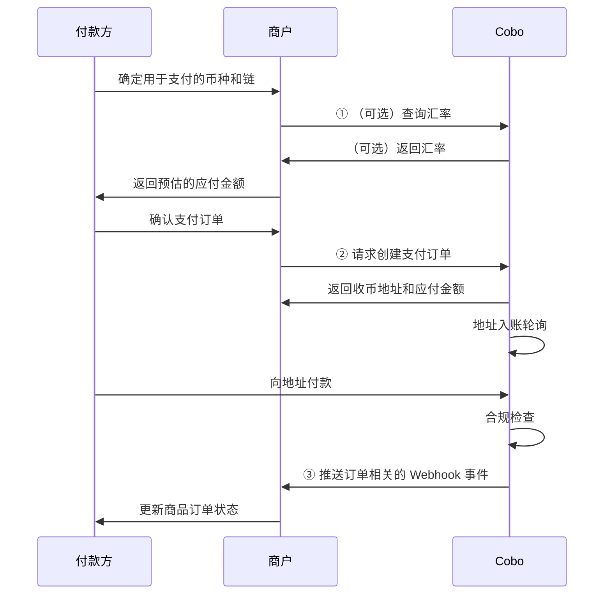
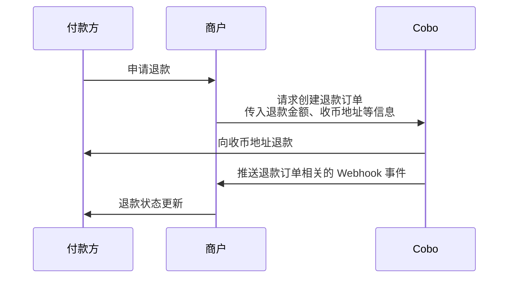

订单模式适用于需要指定具体支付金额和时限的场景。在该模式下，Cobo 会创建带有以下特点的支付订单：

- **固定金额**：订单创建时即指定具体的应付金额
- **有效期限**：付款方需要在指定时间内完成支付
- **异常处理**：支持多种异常情况的处理，包括：
  - 取消尚未支付的订单
  - 对已支付订单发起退款
  - 处理多付、少付、晚付等支付异常

## 创建订单

您可以通过两种方式创建订单：

- 调用 [Create pay-in order](/v2/api-references/payment/create-pay-in-order) 直接创建一个支付订单。调用成功后，您将得到应付金额、付款地址等信息；
- 调用 [Create order link](/v2/api-references/payment/create-order-link) 创建一个订单支付链接。该链接会跳转到由 Cobo 提供的支付页面，付款方可在该页面创建订单并完成支付，无需您自行开发前端交互流程。您还可以通过 iFrame 方式将该支付页面嵌入到您的网站或应用中。

### 前提条件
您已完成[前置准备](/v2_cn/payments/preparation)中提到的所有步骤。

### 操作步骤

<Tabs>
  <Tab title="使用 Payments API 创建支付订单" icon="code">

您可以调用 [Create pay-in order](/v2/api-references/payment/create-pay-in-order) 来创建一个支付订单。下图展示了付款方、商户与 Cobo 之间的完整交互流程：

创建订单时，您需要指定商品订单金额、付款方支付所用的加密货币等信息，系统会根据这些信息计算出订单的应付金额（`payable_amount`）。应付金额的计算公式为：

**应付金额** = **（商品订单金额 + 开发者费用）** / **汇率**

- **应付金额**：付款方实际需支付的加密货币金额，以 `token_id` 指定的加密货币为单位。例如，若 `token_id` 为 `ETH_USDT`，则付款方需通过 ETH 链支付相应金额的 USDT。
- **商品订单金额**：您在创建订单时传入的 `order_amount` 字段。
- **开发者费用**：您在创建订单时传入的 `fee_amount` 字段。如果您是服务多个下游商户的平台机构，需要在您和下游商户之间分配收入，可以通过设置该费用来实现。开发者费用和商品订单金额之间的比例决定了您和下游商户之间的收入分成比例。更多信息请参考[资金分配与余额管理](/v2_cn/payments/amounts-and-balances)。
  <Info>如果您是商户（直接服务于付款方），通常无需设置开发者费用。</Info>
- **汇率**：
  - 如果您只设置了 `token_id` 字段，未设置 `currency` 字段，则商品订单金额和开发者费用都以 `token_id` 指定的加密货币为单位。此时的汇率固定为 1，无需进行换算。
  - 如果您设置了 `currency` 字段，则商品订单金额和开发者费用都以 `currency` 指定的法币为单位。
    - 如果您设置了 `custom_exchange_rate` 字段，则汇率为 `custom_exchange_rate` 字段值。
    - 如果您未设置 `custom_exchange_rate` 字段，则汇率为 `currency` 指定的法币与 `token_id` 指定的加密货币之间的实时汇率，以创建订单时调用 [Get exchange rate](/v2/api-references/payment/get-exchange-rate) 操作返回的汇率为准。 
  

下表展示了在四种不同设置下，系统如何计算应付金额：

|  | 场景 1 | 场景 2 | 场景 3 | 场景 4 |
| :-- | :-- | :-- | :-- | :-- |
| 场景描述 | - 订单金额以法币计价  - 无需设置开发者费用  - 使用默认汇率 | - 订单金额以加密货币计价  - 无需设置开发者费用  - 使用默认汇率  | - 订单金额以法币计价  - 设置开发者费用  - 使用自定义汇率 | - 订单金额以加密货币计价  - 设置开发者费用  - 使用默认汇率 |
| `order_amount` | `"100"` | `"100"` | `"100"` | `"100"` |
| `fee_amount` | `"0"` 或不设置 | `"0"` 或不设置 | `"2"` | `"2"` |
| `currency` | `"USD"` | 不设置 | `"USD"` | 不设置 |
| `token_id` | `"ETH_USDT"` | `"ETH_USDT"` | `"ETH_USDT"` | `"ETH_USDT"` |
| `custom_exchange_rate` | 不设置 | 不设置 | `"0.98"` | 不设置 |
| 实时汇率 | 0.99 | 1 | 0.99 | 1 |
| 计算过程 | (100 + 0) / 0.99 | (100 + 0) / 1 | (100 + 2) / 0.98 | (100 + 2) / 1 |
| `payable_amount`（付款方最终应付的金额） | `"101.01"` | `"100"` | `"104.08"` | `"102"` |

</Tab>
  <Tab title="使用 Payments API 创建支付链接" icon="browser">
  您可以调用 [Create order link](/v2/api-references/payment/create-order-link) 创建一个订单支付链接。具体的支付页面效果和集成步骤请参考[创建订单支付链接](/v2_cn/payments/payment-link)。
  </Tab>
</Tabs>

## 查询订单状态

您可以订阅以下 Webhook 事件，以获取订单状态的实时更新通知。请参考 [Webhook reference](/v2_cn/payments/status-and-events) 了解每个事件的触发时间和返回的数据结构。  

- `payment.status.updated`
- `payment.transaction.created`
- `payment.transaction.late`
- `payment.transaction.held`
- `payment.transaction.completed`

您也可以通过 Payments App 或 Payments API 主动查询订单状态。

<Tabs>
  <Tab title="Payments App" icon="pager">
1. 登录 Cobo Portal [开发环境](https://portal.dev.cobo.com/login)或[生产环境](https://portal.cobo.com/login)。
2. 在左侧导航栏中点击 **Apps**，然后点击 **Payments** 卡片，启动 App。
3. 在 App 的左侧导航栏中点击**收款** > **订单**。您可以在此页面查看所有订单的详细信息，如订单 ID、商户信息、支付金额、订单状态等。
4. 当付款方完成支付、且交易通过合规扫描后，订单状态会流转为**已完成**。

  </Tab>

  <Tab title="Payments API" icon="code">
您可以调用 [Get pay-in order information](/v2/api-references/payment/get-pay-in-order-information) 查询单个支付订单状态，或调用 [List all pay-in orders](/v2/api-references/payment/list-all-pay-in-orders) 查询所有订单状态。

  </Tab>
</Tabs>

## 异常情况

在订单模式下，您可能要处理以下几种异常情况。

### 撤销支付订单

当一笔支付订单在 `Pending` 状态下，即尚未检测到入账交易时，您可以调用 [Update pay-in order](/v2/api-references/payment/update-pay-in-order) 撤销该订单。撤销后，订单状态将变更为 `Expired`。

### 多付、少付和晚付

在支付过程中可能出现以下三种异常情况：

| 异常情况 | 描述 | 影响 |
|---------|------|----------|
| **多付** | 在订单有效期内，付款方实付金额超过应付金额 | 订单最终状态为 `Completed`。|
| **少付** | 在订单有效期内，付款方实付金额少于应付金额 | 订单状态为 `Underpaid`（终态）。|
| **晚付** | 付款方在订单过期后进行首次或再次付款 | 不会改变订单状态。每次晚付都会触发一次 `payment.transaction.late` Webhook 事件。|

[资金分配与余额管理](/v2_cn/payments/amounts-and-balances)中详细介绍了多付、少付和晚付情况下，Cobo 对资金的处理规则。

### 处理退款申请
您可以通过 Payments App 或 Payments API 发起一笔退款订单，将资金退还给付款方。下图展示了退款环节中，付款方、商户以及 Cobo 之间的交互流程。

#### 创建退款订单

<Tabs>
  <Tab title="Payments App" icon="pager">
1. 登录 Cobo Portal [开发环境](https://portal.dev.cobo.com/login)或[生产环境](https://portal.cobo.com/login)。
2. 在左侧导航栏中点击 **Apps**，然后点击 **Payments** 卡片，启动 App。
3. 在 App 的左侧导航栏中点击**收款** > **订单**。
4. 选择目标订单，然后点击右侧的**查看详情**按钮。

5. 在订单详情页面，点击**退款**按钮。

6. 在弹出的表单中：
   - 选择退款金额的来源，可以选择**商户余额**或**开发者余额**。
   - 填入退款金额。该金额不得高于对应的商户余额或开发者余额。
   - （可选）填入开发者费用金额。该手续费会从退款金额中扣除，归入开发者余额。有关开发者费用的详细说明，请参考[资金分配与余额管理](/v2_cn/payments/amounts-and-balances)。
   - 输入收款地址。您可以点击**使用原始支付地址**，系统将自动填入该笔订单的原始支付地址。如果您想退款到其他地址，也可以手动输入目标地址。
5. 点击**预览**确认所有信息无误后，点击**提交**创建退款订单。

  </Tab>
  <Tab title="Payments API" icon="code">
调用 [Create refund order](/v2/api-references/payment/create-refund-order) 创建退款订单。创建退款订单时需要注意以下几点：

   - 您需要通过 `refund_type` 字段指定退款金额的来源。当您选择 `Merchant` 时，Cobo 会从商户余额中扣除退款金额；当您选择 `Psp` 时，Cobo 会从开发者余额中扣除退款金额。
   - 由于退款涉及到向外部地址转账，Cobo 会收取相关手续费。您可以通过开发者费用字段（`merchant_fee_amount`）收取适当的费用作为补偿。指定该字段后：
     - 如果您选择从商户余额中扣除退款金额，Cobo 会将开发者费用从商户余额划转至开发者余额，资金会保留在原地址，不会发生实际转账。
     - 付款方实际收到的退款金额 = 指定退款金额 - 开发者费用（即 `payable_amount` - `merchant_fee_amount`）。
     - Cobo 会对退款金额进行校验。如果退款金额小于开发者费用，该请求将被拒绝并返回失败原因，因为此时付款方实际无法收到任何退款。

<Info>关于更多开发者费用的说明，请参考[资金分配与余额管理](/v2_cn/payments/amounts-and-balances)。</Info>

  </Tab>
</Tabs>

#### 查询退款订单状态
您可以订阅 `payment.refund.status.updated` 事件，获取退款订单状态的实时更新。请参考 [Webhook reference](/v2_cn/payments/status-and-events) 了解每个事件的详细触发条件和返回的数据结构。

您也可以通过 Payments App 或 Payments API 主动查询退款订单状态。

<Tabs>
  <Tab title="Payments App" icon="pager">
1. 登录 Cobo Portal [开发环境](https://portal.dev.cobo.com/login)或[生产环境](https://portal.cobo.com/login)。
2. 在左侧导航栏中点击 **Apps**，然后点击 **Payments** 卡片，启动 App。
3. 在 App 的左侧导航栏中点击**收款** > **订单**。
4. 点击**退款**标签页。在退款订单列表中，找到目标订单，然后点击右侧的**查看详情**按钮。

5. 在退款订单详情页面查看订单状态。

  </Tab>
  <Tab title="Payments API" icon="code">
您可以调用 [Get refund order information](/v2/api-references/payment/get-refund-order-information) 查询单个退款订单状态，或调用 [List all refund orders](/v2/api-references/payment/list-all-refund-orders) 查询所有退款订单状态。
  </Tab>
</Tabs>

### 合规扫描不通过

当某笔交易收到 `payment.transaction.held` 事件，但长期未收到 `payment.transaction.completed` 事件时，这表明该笔交易未能通过 Cobo KYT 或 Screening App 的合规扫描。这种情况下，您需要按照以下步骤进行处理：

- 若该笔交易后续通过人工审核：
    - 如果订单未过期：该笔资金将计入订单实收金额，订单状态将根据实收金额相应更新
    - 如果订单已过期：系统将触发 `payment.transaction.late` 事件，该笔资金将全部计入开发者余额

- 若该笔交易最终未通过人工审核：
    - 资金将被冻结，不会被计入订单实收金额
    - 订单状态将保持不变
    - 付款方需要在订单有效期内重新充入足额资金并通过合规扫描，订单才能转为 `Completed` 状态
  
对于被隔离或冻结的资金：
- Cobo KYT：请通过 [help@cobo.com](mailto:help@cobo.com) 联系 Cobo 支持团队处理
- Screening App：您可以在应用内自行评估和处理

<Tip>欢迎您[提交反馈](https://forms.zohopublic.com/cobo/form/DocumentFeedbackForm/formperma/QvLOhxJv1_JMsJ-1dleZ8Itb_7rzN-LtgvsDdxosoVI)来帮助改进我们的文档！</Tip>