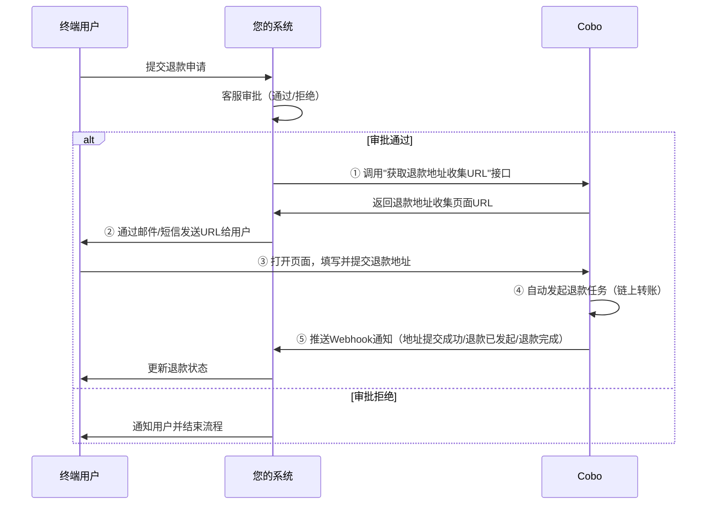

本文介绍如何创建一个退款链接。当终端用户在Payment Link收银台中完成一笔数币订单的付款后，因各种原因需要退款时，您可以通过该功能让终端用户填写退款地址，由Cobo自动完成退款转账的闭环流程。

## 适用场景

1. 终端用户在收银台中完成一笔数币订单的付款后，因各种原因需要退款，在您的App/平台内主动申请退款。您的客服在内部系统审批，通过或拒绝。

2. 若用户的退款申请审批通过，您使用API获取Cobo"退款地址收集页面URL"，通过邮箱等方式发送给终端用户（Cobo无终端用户邮箱，URL需由您自行发送给用户），终端用户填写地址后，由Cobo完成"自动退款转账"的闭环流程。

3. 您可以通过Webhook监听Cobo回调/状态查询，跟踪"地址已提交/退款已发起/已完成"。确认退款完成并在您的系统内同步订单状态，关闭工单。

## 流程概览

以下流程图展示了退款地址收集的完整交互过程：

流程步骤说明：

* **步骤1（您的后端）**：调用"获取退款地址收集URL"接口，拿到URL
* **步骤2（您的后端）**：将该URL通过邮件/短信发送给用户
* **步骤3（Cobo前端）**：用户在页面填写并提交接收退款的地址
* **步骤4（Cobo后端）**：Cobo自动使用该地址发起退款任务，并通过Webhook通知您"地址提交成功/退款已发起/退款完成"等状态

## 快速接入

### 前提条件

您已完成[前置准备](/v2_cn/payments/preparation)中提到的所有步骤，包括：

* 准备API Key和API Secret
* 配置Webhook接收地址与签名校验
* 已接入订单模式收单服务并有收款数据，账户余额不为零
* 通知链路准备
  * 确认给终端用户发送URL的强通知渠道（如邮件/短信/IM），可提前准备如邮件模板与发件域名白名单（例如仅对有过消费记录的用户邮箱触发退款通知）
* 风控合规
  * 在Cobo Portal中设置提币风控规则，退款也属于提币，触发规则时（例如超过金额阈值）需管理员审核通过再执行转账交易，以避免大额风险

### 端到端流程

#### 1. 用户提交退款申请（您的系统）

1. 用户在您的页面发起退款申请，填写订单号/原因等。
2. 客服在您的后台审批：通过或拒绝。
3. 被拒绝：在您的系统内通知用户并结束流程。

#### 2. 获取退款地址收集URL（您的后端）

调用 [Create refund link](/v2/api-references/payment/create-refund-link) 接口：

**接口地址**：`POST https://api.cobo.com/v2/payments/links/refunds`

**请求参数**：

* `transaction_id`：原用户付款交易ID。用于关联原订单/充值中的交易的from地址（默认退回原地址）、token ID（退原币种&链）
* `amount`：应退金额。一般是用户原订单实付金额
* `refund_source`：退款金额来源，即选择从PSP Balance转出还是指定某个Merchant Balance转出，若选择Merchant则需要指定Merchant ID
* `merchant_id`：选填，当`refund_source`选择Merchant时需要指定
* `fee_amount`：选填，退款手续费，如果来源选择PSP Balance则无效

**响应字段**：

* `url`：退款地址收集页面URL，一次性链接，只可提交一次
* `token`：退款请求唯一性标识

#### 3. 向用户发送URL（您的后端）

1. 使用您自研脚本/服务，将URL通过邮件/短信发送给用户，需您自行发送，Cobo不掌握终端用户邮箱。

2. 用户侧关键提示（建议在邮件内与页面均提示，页面内Cobo已做提示处理）：
   * 本页面仅供原付款人使用，请勿转发，如非本人请勿提交。
   * 仅支持指定链/资产，请核对网络与地址，必要时填写Memo/Tag；区块链转账不可逆。
   * 若默认显示为交易所/托管地址，建议更换为个人可控地址以确保及时到账。
   * 我们不会索取您的私钥/助记词/验证码，谨防诈骗。

<Warning>**安全提示**：建议您自行增加2FA验证方式，例如用户需要先输入邮箱/短信验证码后，方可访问退款URL，以防链接泄漏从而资产被误领取。</Warning>

#### 4. 用户提交退款地址（Cobo的前端页面）

1. 用户打开URL，按页面指引填写收款链/地址，提交后完成地址校验与确认。
2. Cobo接收后将状态变更为"地址提交成功"，并包含新地址信息的通知。
3. 用户看到的页面如图所示：

**默认退款地址页面**（显示原付款地址）：

**更改退款地址页面**（需要填写新地址和Memo）：

#### 5. 自动发起退款与通知（Cobo的后端）

1. Cobo自动使用用户提交的地址信息发起退款任务（链上转账），并通过Webhook通知关键状态：
   * `link_pending`：收集页面首次打开，用户正在填写中
   * `link_submitted`：地址提交成功，附network/address
   * `refund.pending`：退款已发起，附txid等
   * `refund.completed`：退款完成
   * `refund.failed`：失败原因与是否可重试

2. 您也可通过"查询退款"接口按`refund_id`主动拉取状态。

关于Webhook事件的详细信息，请参考[状态与事件](/v2_cn/payments/status-and-events)。

## 查询与重试

### 查询退款状态

您可以通过以下方式查询退款状态：

**接口地址**：`GET https://api.cobo.com/v2/payments/refunds/{refund_id}`

### 重新获取URL

若链接已用，调用同一接口生成新URL，再次发送给用户。

<Info>退款地址收集URL为一次性链接，用户提交地址后即失效。如需重新收集地址，请调用接口生成新的URL。</Info>

## 常见错误与处理

### 地址风险与合规要求

* **Cobo KYT被拒绝的情况**：若原交易因Cobo KYT被拒绝，用户更换地址时需按页面提示补充材料（证明新旧地址属于同一个交易所平台）；未补充则无法继续，需要Cobo客服介入处理。

* **您设置的KYT规则被拒绝**：若原交易因您设置的KYT规则被拒绝、或未拒绝的交易，更换地址通常无需额外材料。

<Note>如遇到其他问题，请通过 [help@cobo.com](mailto:help@cobo.com) 联系Cobo支持团队。</Note>

<Tip>欢迎您[提交反馈](https://forms.zohopublic.com/cobo/form/DocumentFeedbackForm/formperma/QvLOhxJv1_JMsJ-1dleZ8Itb_7rzN-LtgvsDdxosoVI)来帮助改进我们的文档！</Tip>

