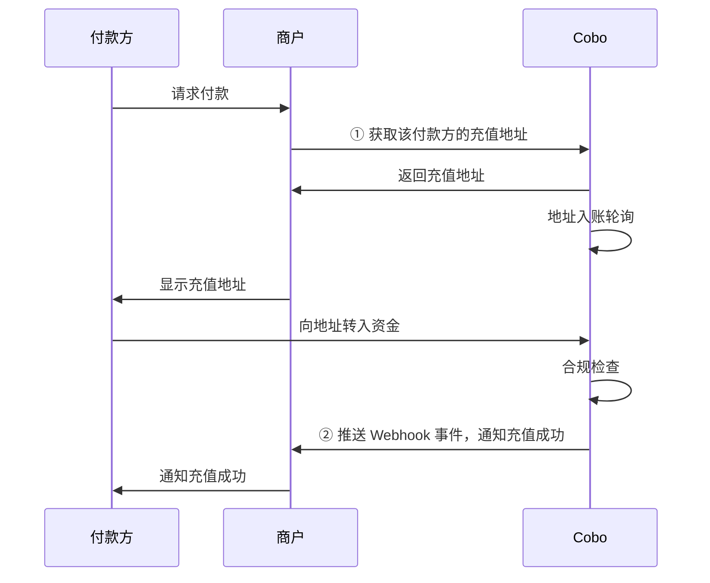

充值模式下，Cobo 会为每个付款方生成固定的充值地址，付款方可以随时向该地址充值任意金额。下图展示了付款方、商户（您）以及 Cobo 之间的交互流程：

## 获取充值地址
您可以通过 Payments App 或 Payments API 获取充值地址。将充值地址提供给付款方后，付款方可以随时向该地址充值任意金额。

### 前提条件
您已完成[前置准备](/v2_cn/payments/preparation)中提到的所有步骤。

### 操作步骤

<Tabs>
  <Tab title="Payments App" icon="pager">
#### 1. 创建付款方
您需要先创建付款方，然后获取该付款方对应的充值地址：
1. 登录 Cobo Portal [开发环境](https://portal.dev.cobo.com/login)或[生产环境](https://portal.cobo.com/login)。
2. 在左侧导航栏中点击 **Apps**，然后点击 **Payments** 卡片，启动 App。
3. 在 App 的左侧导航栏中点击**收款** > **充值**。
4. 点击右上角的**创建付款方**按钮。
5. 在弹出的表单中：
   - 选择商户。该付款方支付的款项会归属于该商户。
   - 选择代币和网络。Cobo 会为该付款方创建一个该网络上的专属充值地址。创建付款方后，您还可以为该付款方在其他网络上创建更多充值地址，以支持多链充值。
   - 输入自定义付款方 ID。此 ID 需要是此付款方在您的系统中的唯一标识。
5. 点击**创建**完成付款方创建。

#### 2. 获取充值地址
1. 在付款方列表中找到目标付款方，然后点击右侧的**查看地址**按钮。

2. 您可以在地址列表中查看已创建好的地址。如果您想要添加其他公链上的地址，可以点击**创建地址**按钮进行创建。

3. 将所需充值地址提供给付款方，完成支付。
  </Tab>
  
  
  <Tab title="Payments API" icon="code">
1. 调用 [Create/Get top-up address](/v2/api-references/payment/createget-top-up-address) 创建充值地址。请求中的关键参数包括：
   * **商户 ID** (`merchant_id`)：商户在 Cobo 系统中的唯一标识，由 Cobo 分配。
   * **自定义付款方 ID** (`custom_payer_id`)：付款方在您的系统中的唯一标识。
   * **Token ID** (`token_id`)：指定充值地址需要支持的加密货币和区块链网络。
2. **配置充值事件监听**：通过 Webhook 接收充值相关的事件通知，详情可参考[事件与状态](/v2_cn/payments/status-and-events)。

  </Tab>
</Tabs>

## 获取充值模式相关事件

您可以订阅以下 Webhook 事件，以获取充值地址以及充值交易的实时更新通知。请参考 [Webhook reference](/v2_cn/payments/status-and-events) 了解每个事件的触发时间和返回的数据结构。  

- `payment.address.updated`
- `payment.transaction.created`
- `payment.transaction.held`
- `payment.transaction.completed`

您也可以通过以下方式查询每个付款方的所有充值交易：

- **Payments App**：在 App 的左侧导航栏中点击**收款** > **充值**，在付款方列表中找到目标付款方，点击右侧的**查看交易**按钮即可查看该付款方的所有充值记录。
- **Payments API**：调用 [List payers](/v2/api-references/payment/list-payers) 获取所有付款方及其充值交易的详细信息。

## 异常处理

在充值模式下，您可能要处理以下几种异常情况。

### 充值地址更换

您可以主动更换某一个付款方的充值地址。Cobo 也会在特定情况下自动更换充值地址。

#### 主动更换地址

当您需要更换充值地址时（例如因业务变更、内部风险评估或其他业务需求），可以通过 Payments App 或 Payments API 创建新地址。
- Payments App：在付款方列表中找到目标付款方，然后点击右侧的**查看地址**按钮。在地址列表中，点击**创建地址**按钮进行创建。
- Payments API：调用 [Update top-up address](/v2/api-references/payment/update-top-up-address) 创建新地址。

<Note>对于单个付款方，最多可进行 10 次地址更换，超过次数上限会出现接口请求报错。</Note>

#### 系统自动更换地址

当某一充值地址出现多次交易无法通过合规扫描的情况时，Cobo 会自动废弃该地址，并为该付款方生成新的充值地址。更换后会触发 `payment.address.updated` 回调，详情可参考[事件与状态](/v2_cn/payments/status-and-events)。

#### 地址更换后的影响

<Warning>
地址更换后，请务必及时通知付款方使用新地址进行充值。
</Warning>

- **交易监听**：Cobo 会继续监听老地址的交易活动，交易会触发对应的 Webhook 通知。
- **资金处理**：该地址与商户的关联关系依然存在。按照原有配置，收到的资金会分配到对应的商户余额，如果该商户配置了开发者费率，相应比例的资金会被分配到开发者余额中。
- **地址查询**：您在 Payments App 上可以查看付款方历史上所有绑定过的地址。

### 合规扫描不通过

当某笔交易收到 `payment.transaction.held` 事件，但长期未收到 `payment.transaction.completed` 事件时，这表明该笔交易未能通过 Cobo KYT 或 Screening App 的合规扫描。这种情况下，您需要按照以下步骤进行处理：

- 若该笔交易后续通过人工审核：该笔资金将计入充值金额。
- 若该笔交易最终未通过人工审核：资金将被冻结，不会被计入充值金额
  
对于被隔离或冻结的资金：
- Cobo KYT：请通过 [help@cobo.com](mailto:help@cobo.com) 联系 Cobo 支持团队处理
- Screening App：您可以在应用内自行评估和处理

<Tip>欢迎您[提交反馈](https://forms.zohopublic.com/cobo/form/DocumentFeedbackForm/formperma/QvLOhxJv1_JMsJ-1dleZ8Itb_7rzN-LtgvsDdxosoVI)来帮助改进我们的文档！</Tip>