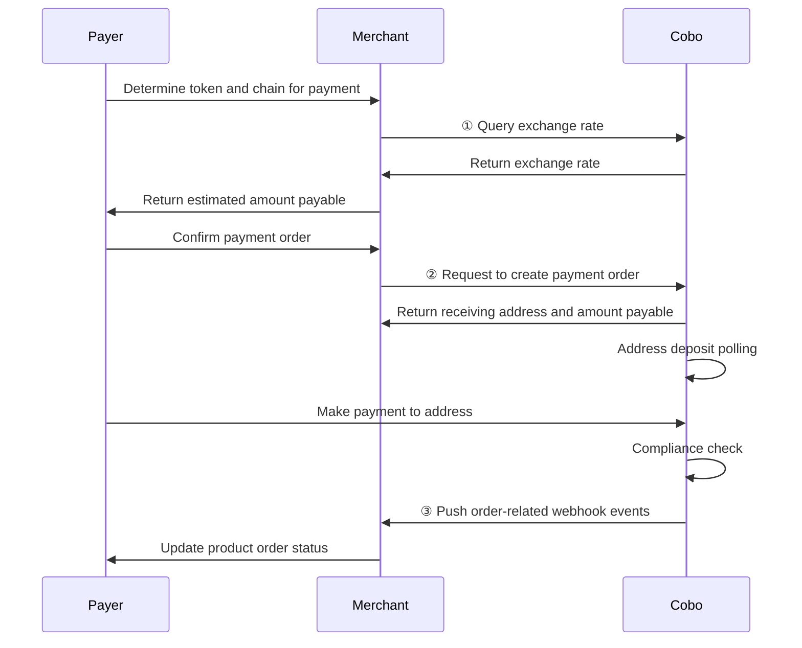
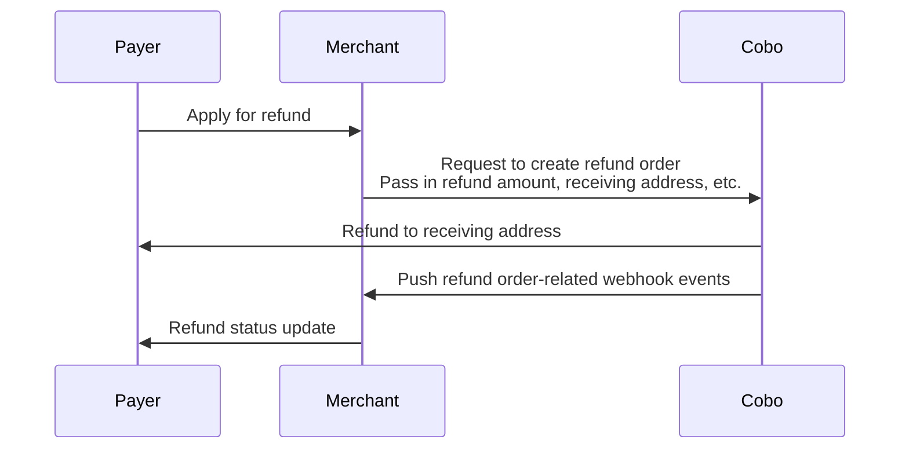

<Note>**Disclaimer: This article contains AI translations and should only be used as reference.** Contact Cobo's support team through [help@cobo.com](mailto:help@cobo.com) if you have any questions.</Note>

Order mode is suitable for scenarios that require specifying a specific payment amount and time limit. In this mode, Cobo creates payment orders with the following characteristics:

- **Fixed amount**: The amount payable is specified when the order is created
- **Validity period**: Payers need to complete payment within the specified time
- **Exception handling**: Supports handling various exception situations, including:
  - Canceling orders that have not been paid
  - Initiating refunds for paid orders
  - Handling payment exceptions such as overpayment, underpayment, and late payment

The following diagram shows the complete interaction process between payers, merchants, and Cobo during the order payment process:

## Create order

You can create an order in two ways:

- Call [Create pay-in order](/v2/api-references/payment/create-pay-in-order) to directly create a payment order. After a successful call, you will receive information such as the payable amount and payment address.
- Call [Create order link](/v2/api-references/payment/create-order-link) to generate a payment link. This link will direct users to a payment page provided by Cobo, where they can create an order and complete payment without you needing to develop the front-end interaction. You can also embed this payment page into your website or application using an iFrame.

### Prerequisites

You have completed all the steps mentioned in [Preparation](/v2/payments/preparation).

### Implementation steps

<Tabs>
  <Tab title="Payment Link" icon="browser">
  You can call [Create order link](/v2/api-references/payment/create-order-link) to create an order payment link. The payment page is provided by Cobo, and users can access the link directly to complete the order payment. You can also embed the page into your existing website through an iFrame. For details, see [Create order link](/v2/payments/payment-link).
  </Tab>
  <Tab title="Payments API" icon="code">

You can call [Create pay-in order](/v2/api-references/payment/create-pay-in-order) to create a payment order. When creating an order, you need to specify the order amount, the cryptocurrency that the user will use for payment, and other information. The system will calculate the payable amount (`payable_amount`) based on this information. The calculation formula for the payable amount is:

**Payable Amount** = **(Order Amount + Developer Fee)** / **Exchange Rate**

- **Payable Amount**: The actual cryptocurrency amount that the user needs to pay, denominated in the cryptocurrency specified by `token_id`. For example, if `token_id` is `ETH_USDT`, the user needs to pay the corresponding amount in USDT on the Ethereum chain.
- **Order Amount**: The `order_amount` field you pass in when creating the order.
- **Developer Fee**: The `fee_amount` field you pass in when creating the order. If you are a platform serving multiple downstream merchants and need to distribute revenue between you and your downstream merchants, you can set this fee to achieve that. The ratio between the developer fee and the order amount determines the revenue split between you and your downstream merchants. For more information, see [Amount Distribution and Balance Management](/v2/payments/amounts-and-balances).
  <Info>If you are a merchant (serving users directly), you typically don't need to set the developer fee.</Info>
- **Exchange Rate**:
  - If you only set the `token_id` field and do not set the `currency` field, both the order amount and developer fee are denominated in the cryptocurrency specified by `token_id`. In this case, the exchange rate is fixed at 1 and no conversion is required.
  - If you set the `currency` field, both the order amount and developer fee are denominated in the fiat currency specified by `currency`.
    - If you set the `custom_exchange_rate` field, the exchange rate is the value specified by `custom_exchange_rate`.
    - If you do not set the `custom_exchange_rate` field, the exchange rate is the real-time rate between the fiat currency specified by `currency` and the cryptocurrency specified by `token_id`, based on the rate returned by [Get exchange rate](/v2/api-references/payment/get-exchange-rate) at the time the order is created.

The table below shows how the payable amount is calculated by the system in four different configuration scenarios:

|  | Scenario 1 | Scenario 2 | Scenario 3 | Scenario 4 |
| :-- | :-- | :-- | :-- | :-- |
| Scenario Description | - Order amount in fiat currency  - Developer fee not set  - Use default exchange rate | - Order amount in cryptocurrency  - Developer fee not set  - Use default exchange rate | - Order amount in fiat currency  - Developer fee set  - Use custom exchange rate | - Order amount in cryptocurrency  - Developer fee set  - Use default exchange rate |
| `order_amount` | `"100"` | `"100"` | `"100"` | `"100"` |
| `fee_amount` | `"0"` or not set | `"0"` or not set | `"2"` | `"2"` |
| `currency` | `"USD"` | Not set | `"USD"` | Not set |
| `token_id` | `"ETH_USDT"` | `"ETH_USDT"` | `"ETH_USDT"` | `"ETH_USDT"` |
| `custom_exchange_rate` | Not set | Not set | `"0.98"` | Not set |
| Real-time exchange rate | 0.99 | 1 | 0.99 | 1 |
| Calculation Process | (100 + 0) / 0.99 | (100 + 0) / 1 | (100 + 2) / 0.98 | (100 + 2) / 1 |
| `payable_amount` (final amount payable by user) | `"101.01"` | `"100"` | `"104.08"` | `"102"` |
</Tab>
  <Tab title="Create order link" icon="browser">
  You can call [Create order link](/v2/api-references/payment/create-order-link) to create an order payment link. The payment page is provided by Cobo, and users can access the link directly to complete the order payment. You can also embed the page into your existing website through an iFrame. For details, see [Create order link](/v2/payments/payment-link).
  </Tab>
</Tabs>

## Query order status

You can subscribe to the following webhook events to receive real-time update notifications of order status. Refer to [Webhook reference](/v2/payments/status-and-events) to understand the trigger time and returned data structure of each event.  

- `payment.status.updated`
- `payment.transaction.created`
- `payment.transaction.late`
- `payment.transaction.held`
- `payment.transaction.completed`

You can also actively query order status through Payments App or Payments API.

<Tabs>
  <Tab title="Payments App" icon="pager">
1. Log in to Cobo Portal [development environment](https://portal.dev.cobo.com/login) or [production environment](https://portal.cobo.com/login).
2. In the left navigation bar, click **Apps**, then click the **Payments** card to launch the App.
3. In the App's left navigation bar, click **Pay-In** > **Orders**. You can view detailed information of all orders on this page, such as order ID, merchant information, payment amount, order status, etc.
4. After the payer completes payment and the transaction passes compliance screening, the order status will change to **Completed**.

  </Tab>

  <Tab title="Payments API" icon="code">
You can call [Get pay-in order information](/v2/api-references/payment/get-pay-in-order-information) to query the status of a single payment order, or call [List all pay-in orders](/v2/api-references/payment/list-all-pay-in-orders) to query the status of all orders.

  </Tab>
</Tabs>

## Exception situations

In order mode, you may need to handle the following exception situations.

### Cancel payment order

When a payment order is in the `Pending` status, that is, no deposit transaction has been detected yet, you can call [Update pay-in order](/v2/api-references/payment/update-pay-in-order) to cancel the order. After cancellation, the order status will change to `Expired`.

### Overpayment, underpayment, and late payment

The following three exception situations may occur during the payment process:

| Exception situation | Description | Impact |
|---------|------|----------|
| **Overpayment** | Within the order validity period, the payer's actual payment amount exceeds the payable amount | The final order status is `Completed`.|
| **Underpayment** | Within the order validity period, the payer's actual payment amount is less than the amount payable | The order status is `Underpaid` (final state).|
| **Late payment** | The payer makes the first or subsequent payment after the order expires | Does not change the order status. Each late payment will trigger one `payment.transaction.late` webhook event.|

[Funds allocation and balances](/v2/payments/amounts-and-balances) details how Cobo handles funds in the case of overpayment, underpayment, and late payment.

### Handle refund requests
You can initiate a refund order through Payments App or Payments API to refund funds to the payer. The following diagram shows the interaction process between payers, merchants, and Cobo during the refund process.

#### Create refund order

<Tabs>
  <Tab title="Payments App" icon="pager">
1. Log in to Cobo Portal [development environment](https://portal.dev.cobo.com/login) or [production environment](https://portal.cobo.com/login).
2. In the left navigation bar, click **Apps**, then click the **Payments** card to launch the App.
3. In the App's left navigation bar, click **Pay-In** > **Orders**.
4. Select the target order, then click the **View Details** button on the right.
5. On the order details page, click the **Refund** button.
6. In the pop-up form:
   - Select the source of the refund amount. You can choose **Merchant balance** or **Developer balance**.
   - Enter the refund amount. This amount must not exceed the corresponding merchant balance or developer balance.
   - (Optional) Enter the developer fee amount. This fee will be deducted from the refund amount and credited to the developer balance. For a detailed description of developer fees, refer to [Funds allocation and balances](/v2/payments/amounts-and-balances).
   - Enter the receiving address. You can click **Use original payment address**, and the system will automatically fill in the original payment address for this order. If you want to refund to another address, you can also manually enter the target address.
5. Click **Preview** to confirm that all information is correct, then click **Submit** to create the refund order.

  </Tab>
  <Tab title="Payments API" icon="code">
Call [Create refund order](/v2/api-references/payment/create-refund-order) to create a refund order. When creating a refund order, pay attention to the following points:

   - You need to specify the source of the refund amount through the `refund_type` field. When you select `Merchant`, Cobo will deduct the refund amount from the merchant balance; when you select `Psp`, Cobo will deduct the refund amount from the developer balance.
   - Since refunds involve transfers to external addresses, Cobo will charge related fees. You can charge an appropriate fee as compensation through the developer fee field (`merchant_fee_amount`). After specifying this field:
     - If you choose to deduct the refund amount from the merchant balance, Cobo will transfer the developer fee from the merchant balance to the developer balance. The funds will remain at the original address and no actual transfer will occur.
     - The actual refund amount received by the payer = specified refund amount - developer fee (i.e., `payable_amount` - `merchant_fee_amount`).
     - Cobo will validate the refund amount. If the refund amount is less than the developer fee, the request will be rejected and the reason for failure will be returned, because in this case the payer cannot actually receive any refund.

<Info>For more information about developer fees, refer to [Funds allocation and balances](/v2/payments/amounts-and-balances).</Info>

  </Tab>
</Tabs>

#### Query refund order status
You can subscribe to the `payment.refund.status.updated` event to receive real-time updates on refund order status. Refer to [Webhook reference](/v2/payments/status-and-events) to understand the detailed trigger conditions and returned data structure of each event.

You can also actively query refund order status through Payments App or Payments API.

<Tabs>
  <Tab title="Payments App" icon="pager">
1. Log in to Cobo Portal [development environment](https://portal.dev.cobo.com/login) or [production environment](https://portal.cobo.com/login).
2. In the left navigation bar, click **Apps**, then click the **Payments** card to launch the App.
3. In the App's left navigation bar, click **Pay-In** > **Orders**.
4. Click the **Refunds** tab. In the refund order list, find the target order, then click the **View Details** button on the right.
5. View the order status on the refund order details page.

  </Tab>
  <Tab title="Payments API" icon="code">
You can call [Get refund order information](/v2/api-references/payment/get-refund-order-information) to query the status of a single refund order, or call [List all refund orders](/v2/api-references/payment/list-all-refund-orders) to query the status of all refund orders.
  </Tab>
</Tabs>

### Compliance screening failure

When a transaction receives the `payment.transaction.held` event but does not receive the `payment.transaction.completed` event for a long time, this indicates that the transaction has failed to pass compliance screening by Cobo KYT or Screening App. In this case, you need to follow these steps to handle it:

- If the transaction subsequently passes manual review:
    - If the order has not expired: The funds will be counted towards the order's actual received amount, and the order status will be updated accordingly based on the actual received amount
    - If the order has expired: The system will trigger the `payment.transaction.late` event, and all funds will be credited to the developer balance

- If the transaction ultimately fails manual review:
    - The funds will be frozen and will not be counted towards the order's actual received amount
    - The order status will remain unchanged
    - The payer needs to redeposit sufficient funds and pass compliance screening within the order validity period for the order to change to `Completed` status
  
For isolated or frozen funds:
- Cobo KYT: Please contact the Cobo support team through [help@cobo.com](mailto:help@cobo.com) for handling
- Screening App: You can evaluate and handle it yourself within the application

<Tip>Feel free to [share your feedback](https://forms.zohopublic.com/cobo/form/DocumentFeedbackForm/formperma/QvLOhxJv1_JMsJ-1dleZ8Itb_7rzN-LtgvsDdxosoVI) to improve our documentation!</Tip>

