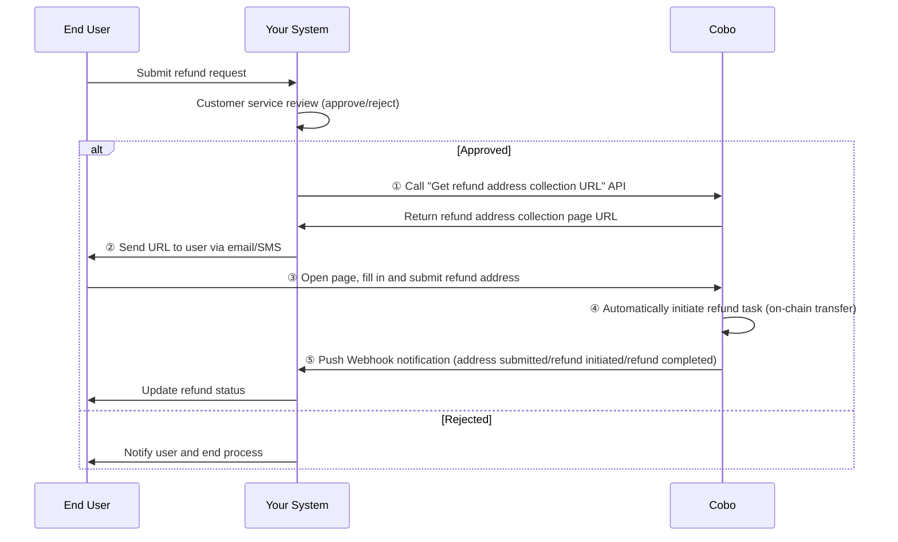

<Note>**Disclaimer: This article contains AI translations and should only be used as reference.** Contact Cobo's support team through [help@cobo.com](mailto:help@cobo.com) if you have any questions.</Note>

This document introduces how to create a refund link. When end users complete a cryptocurrency order payment in the Payment Link checkout and need a refund for various reasons, you can use this feature to let end users fill in refund addresses, with Cobo automatically completing the refund transfer process.

## Use cases

1. After end users complete a cryptocurrency order payment in the checkout, they may need a refund for various reasons and actively apply for a refund in your App/platform. Your customer service team reviews the application in your internal system, approving or rejecting it.

2. If the user's refund application is approved, you use the API to obtain Cobo's "refund address collection page URL" and send it to end users via email or other methods (Cobo does not have end user email addresses, so you need to send the URL to users yourself). After end users fill in the address, Cobo completes the "automatic refund transfer" process.

3. You can monitor Cobo callbacks/status queries through Webhooks to track "address submitted/refund initiated/completed". Confirm the refund is complete and synchronize the order status in your system, closing the ticket.

## Process overview

The following diagram shows the complete interaction process for refund address collection:

Process steps:

* **Step 1 (Your backend)**: Call the "Get refund address collection URL" API to obtain the URL
* **Step 2 (Your backend)**: Send the URL to users via email/SMS
* **Step 3 (Cobo frontend)**: Users fill in and submit the refund receiving address on the page
* **Step 4 (Cobo backend)**: Cobo automatically uses the address to initiate a refund task and notifies you via Webhook of statuses such as "address submitted/refund initiated/refund completed"

## Quick integration

### Prerequisites

You have completed all the steps mentioned in [Preparation](/v2/payments/preparation), including:

* Prepare API Key and API Secret
* Configure Webhook receiving address and signature verification
* Have integrated order mode payment collection service with payment data, and account balance is not zero
* Notification channel preparation
  * Confirm strong notification channels for sending URLs to end users (such as email/SMS/IM), and prepare email templates and sender domain whitelists in advance (for example, only trigger refund notifications for user emails with purchase records)
* Risk control and compliance
  * Set withdrawal risk control rules in Cobo Portal. Refunds are also considered withdrawals. When rules are triggered (for example, exceeding amount thresholds), administrator approval is required before executing transfer transactions to avoid large-amount risks

### End-to-end process

#### 1. User submits refund request (Your system)

1. Users initiate a refund request on your page, filling in order number/reason, etc.
2. Customer service reviews in your backend: approve or reject.
3. If rejected: notify the user in your system and end the process.

#### 2. Get refund address collection URL (Your backend)

Call [Create refund link](/v2/api-references/payment/create-refund-link):

**API endpoint**: `POST https://api.cobo.com/v2/payments/links/refunds`

**Request parameters**:

* `transaction_id`: Original user payment transaction ID. Used to associate the from address in the original order/deposit transaction (default refund to original address) and token ID (refund original token & chain)
* `amount`: Refund amount. Generally the user's original order actual payment amount
* `refund_source`: Source of refund amount, i.e., choose to transfer from PSP Balance or specify a Merchant Balance. If Merchant is selected, you need to specify Merchant ID
* `merchant_id`: Optional, required when `refund_source` is set to Merchant
* `fee_amount`: Optional, refund handling fee. Invalid if source is PSP Balance

**Response fields**:

* `url`: Refund address collection page URL, one-time link that can only be submitted once
* `token`: Unique identifier for the refund request

#### 3. Send URL to user (Your backend)

1. Use your own scripts/services to send the URL to users via email/SMS. You need to send it yourself, as Cobo does not have end user email addresses.

2. Key user-side reminders (recommended to include in both email and page, Cobo has already handled page reminders):
   * This page is for the original payer only. Do not forward. If you are not the original payer, do not submit.
   * Only supports specified chain/assets. Please verify the network and address, and fill in Memo/Tag if necessary. Blockchain transfers are irreversible.
   * If the default display is an exchange/custodial address, it is recommended to change it to a personal controllable address to ensure timely receipt.
   * We will never ask for your private key/mnemonic/verification code. Beware of scams.

<Warning>**Security reminder**: It is recommended that you add 2FA verification, for example, requiring users to enter an email/SMS verification code before accessing the refund URL, to prevent link leakage and assets being mistakenly claimed.</Warning>

#### 4. User submits refund address (Cobo frontend page)

1. Users open the URL and fill in the receiving chain/address according to the page instructions. After submission, address verification and confirmation are completed.
2. After Cobo receives it, the status changes to "address submitted successfully" and includes a notification with the new address information.
3. The pages users see are shown below:

**Default refund address page** (displays original payment address):

**Change refund address page** (requires filling in new address and Memo):

#### 5. Automatically initiate refund and notification (Cobo backend)

1. Cobo automatically uses the address information submitted by users to initiate a refund task (on-chain transfer) and notifies key statuses via Webhook:
   * `link_pending`: Collection page opened for the first time, user is filling in
   * `link_submitted`: Address submitted successfully, includes network/address
   * `refund.pending`: Refund initiated, includes txid, etc.
   * `refund.completed`: Refund completed
   * `refund.failed`: Failure reason and whether it can be retried

2. You can also actively pull the status through the "Query refund" API by `refund_id`.

For detailed information about Webhook events, refer to [Status and events](/v2/payments/status-and-events).

## Query and retry

### Query refund status

You can query refund status through the following method:

**API endpoint**: `GET https://api.cobo.com/v2/payments/refunds/{refund_id}`

### Regenerate URL

If the link has been used, call the same API to generate a new URL and send it to the user again.

<Info>The refund address collection URL is a one-time link that becomes invalid after the user submits the address. If you need to collect the address again, please call the API to generate a new URL.</Info>

## Common errors and handling

### Address risk and compliance requirements

* **Cobo KYT rejection case**: If the original transaction was rejected due to Cobo KYT, users need to provide additional materials according to page prompts when changing addresses (proving that the old and new addresses belong to the same exchange platform). If not provided, the process cannot continue and requires Cobo customer service intervention.

* **Your KYT rule rejection**: If the original transaction was rejected due to your KYT rules, or if the transaction was not rejected, changing addresses usually does not require additional materials.

<Note>If you encounter other issues, please contact Cobo's support team through [help@cobo.com](mailto:help@cobo.com).</Note>

<Tip>Feel free to [share your feedback](https://forms.zohopublic.com/cobo/form/DocumentFeedbackForm/formperma/QvLOhxJv1_JMsJ-1dleZ8Itb_7rzN-LtgvsDdxosoVI) to improve our documentation!</Tip>

