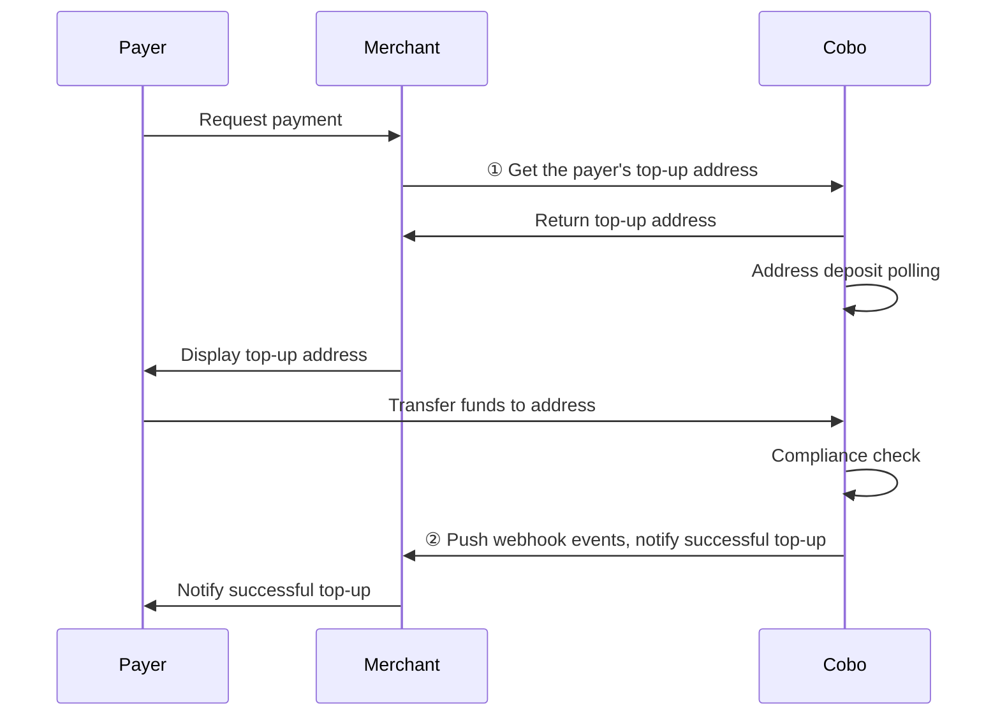

<Note>**Disclaimer: This article contains AI translations and should only be used as reference.** Contact Cobo's support team through [help@cobo.com](mailto:help@cobo.com) if you have any questions.</Note>

In top-up mode, Cobo generates a fixed top-up address for each payer, and payers can top up any amount to that address at any time. The following diagram shows the interaction process between payers, merchants (you), and Cobo:

## Get top-up address
You can get top-up addresses through Payments App or Payments API. After providing the top-up address to the payer, the payer can top up any amount to that address at any time.

### Prerequisites
You have completed all the steps mentioned in [Preparation](/v2/payments/preparation).

### Operation steps

<Tabs>
  <Tab title="Payments App" icon="pager">
#### 1. Create payer
You need to create a payer first, then get the top-up address corresponding to that payer:
1. Log in to Cobo Portal [development environment](https://portal.dev.cobo.com/login) or [production environment](https://portal.cobo.com/login).
2. In the left navigation bar, click **Apps**, then click the **Payments** card to launch the App.
3. In the App's left navigation bar, click **Pay-In** > **Top-Ups**.
4. Click the **Create Payer** button in the upper right corner.
5. In the pop-up form:
   - Select a merchant. The payments made by this payer will belong to this merchant.
   - Select a token and network. Cobo will create a dedicated top-up address on that network for this payer. After creating the payer, you can also create more top-up addresses on other networks for this payer to support multi-chain top-ups.
   - Enter a custom payer ID. This ID needs to be the unique identifier for this payer in your system.
5. Click **Create** to complete payer creation.

#### 2. Get top-up address
1. In the payer list, find the target payer, then click the **View Address** button on the right.

2. You can view the addresses already created in the address list. If you want to add addresses on other chains, you can click the **Create Address** button to create them.

3. Provide the required top-up address to the payer to complete payment.
  </Tab>
  
  
  <Tab title="Payments API" icon="code">
1. Call [Create/Get top-up address](/v2/api-references/payment/createget-top-up-address) to create a top-up address. Key parameters in the request include:
   * **Merchant ID** (`merchant_id`): The unique identifier for the merchant in the Cobo system, assigned by Cobo.
   * **Custom payer ID** (`custom_payer_id`): The unique identifier for the payer in your system.
   * **Token ID** (`token_id`): Specifies the cryptocurrency and blockchain network that the top-up address needs to support.
2. **Configure top-up event listening**: Receive event notifications related to top-ups through webhooks. For details, refer to [Events and status](/v2/payments/status-and-events).

  </Tab>
</Tabs>

## Get top-up mode related events

You can subscribe to the following webhook events to receive real-time update notifications for top-up addresses and top-up transactions. Refer to [Webhook reference](/v2/payments/status-and-events) to understand the trigger time and returned data structure of each event.  

- `payment.address.updated`
- `payment.transaction.created`
- `payment.transaction.held`
- `payment.transaction.completed`

You can also query all top-up transactions for each payer in the following ways:

- **Payments App**: In the App's left navigation bar, click **Pay-In** > **Top-Ups**. In the payer list, find the target payer and click the **View Transaction** button on the right to view all top-up records for that payer.
- **Payments API**: Call [List payers](/v2/api-references/payment/list-payers) to get detailed information about all payers and their top-up transactions.

## Exception handling

In top-up mode, you may need to handle the following exception situations.

### Top-up address replacement

You can actively replace a payer's top-up address. Cobo will also automatically replace top-up addresses in specific situations.

#### Actively replace address

When you need to replace a top-up address (for example, due to business changes, internal risk assessment, or other business needs), you can create a new address through Payments App or Payments API.
- Payments App: In the payer list, find the target payer, then click the **View Address** button on the right. In the address list, click the **Create Address** button to create.
- Payments API: Call [Update top-up address](/v2/api-references/payment/update-top-up-address) to create a new address.

<Note>For a single payer, the address can be replaced a maximum of 10 times. Exceeding the limit will result in an API request error.</Note>

#### System automatically replaces address

When a top-up address has multiple transactions that fail to pass compliance screening, Cobo will automatically abandon that address and generate a new top-up address for the payer. After replacement, the `payment.address.updated` callback will be triggered. For details, refer to [Events and status](/v2/payments/status-and-events).

#### Impact after address replacement

<Warning>
After address replacement, be sure to promptly notify the payer to use the new address for top-ups.
</Warning>

- **Transaction monitoring**: Cobo will continue to monitor transaction activity at the old address, and corresponding transactions will trigger corresponding webhook notifications.
- **Fund handling**: The association between this address and the merchant still exists. According to the original configuration, received funds will be allocated to the corresponding merchant balance, and if the merchant has a developer fee rate configured, the corresponding proportion of funds will also be allocated to the developer balance.
- **Address query**: You can view all addresses that the payer has been bound to in history on Payments App.

### Compliance screening failure

When a transaction receives the `payment.transaction.held` event but does not receive the `payment.transaction.completed` event for a long time, this indicates that the transaction has failed to pass compliance screening by Cobo KYT or Screening App. In this case, you need to follow these steps to handle it:

- If the transaction subsequently passes manual review: The funds will be counted towards the top-up amount.
- If the transaction ultimately fails manual review: The funds will be frozen and will not be counted towards the top-up amount
  
For isolated or frozen funds:
- Cobo KYT: Please contact the Cobo support team through [help@cobo.com](mailto:help@cobo.com) for handling
- Screening App: You can evaluate and handle it yourself within the application

<Tip>Feel free to [share your feedback](https://forms.zohopublic.com/cobo/form/DocumentFeedbackForm/formperma/QvLOhxJv1_JMsJ-1dleZ8Itb_7rzN-LtgvsDdxosoVI) to improve our documentation!</Tip>

