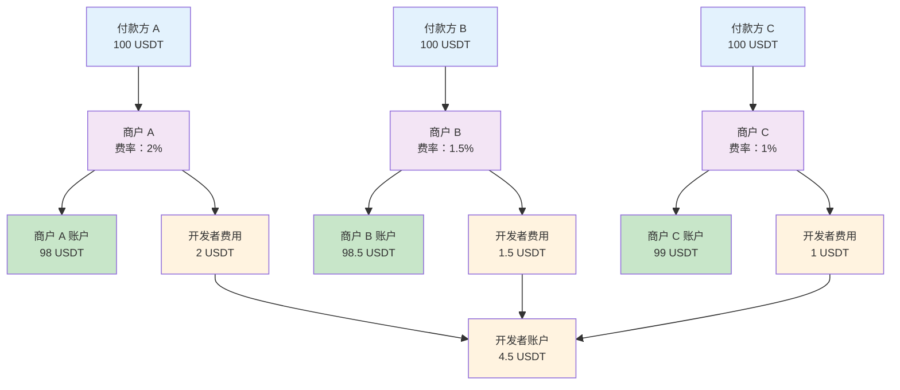
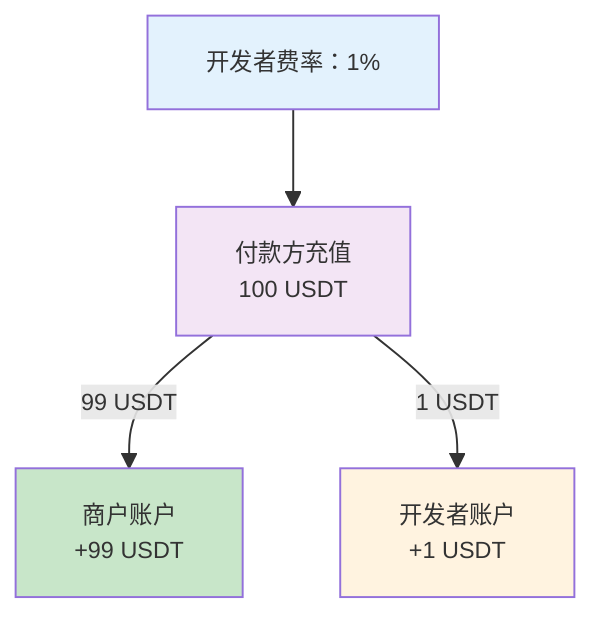
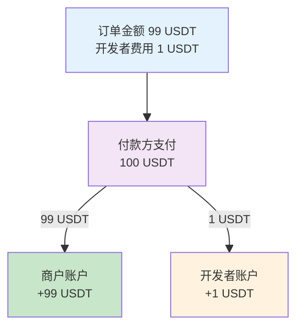
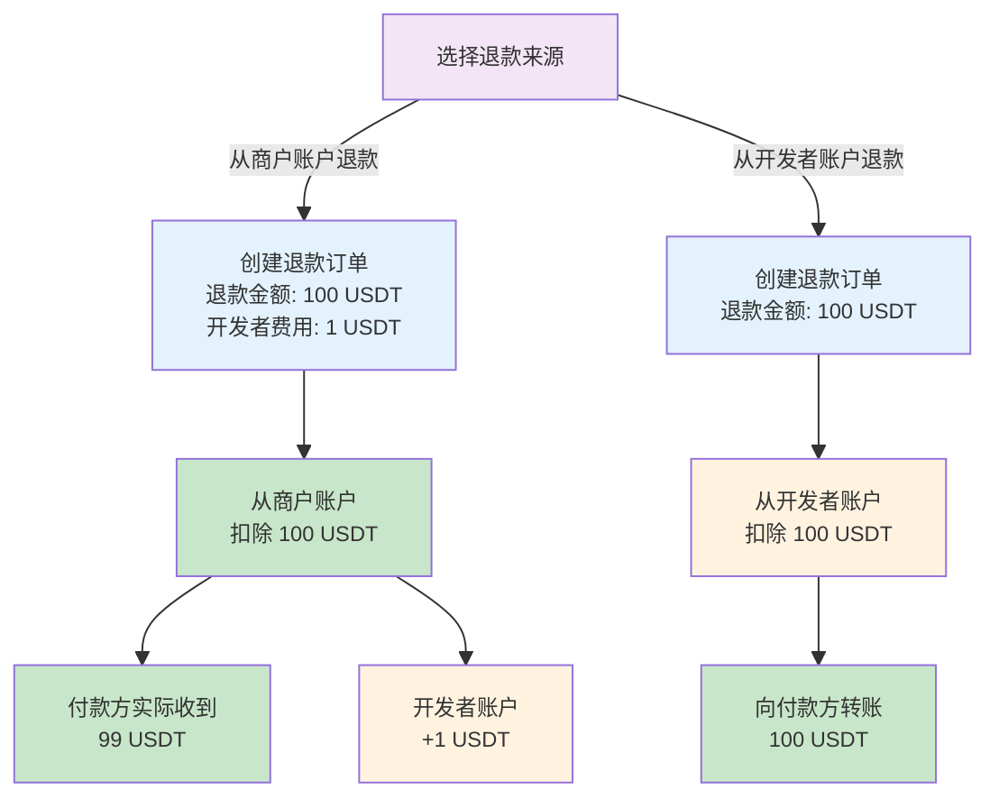
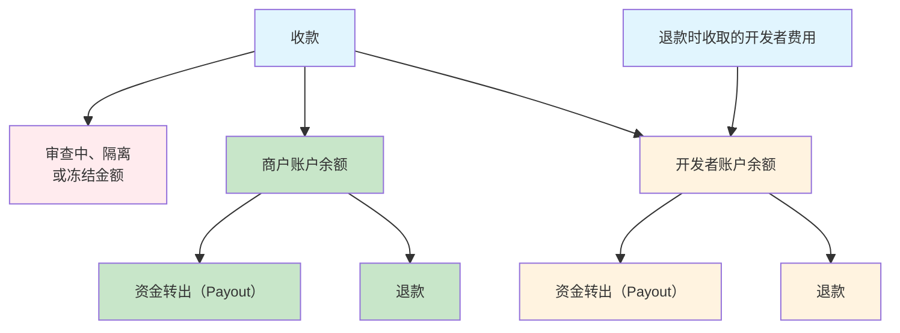

本文介绍资金管理过程中涉及的各类账户，以及收款后资金如何通过**结算**与**划转**在各账户间进行高效分配和管理。

## 账户

账户是在系统账本中管理的虚拟资金主体，与链上钱包或链上地址没有一一对应关系。
- 每一笔收款、划转、退款或资金转出（Payout）等操作，都会在账本中形成明细条目，并据此动态更新各账户的余额。
- 账户间的资金分配（如自动结算、手动划转）仅在账本内部发生，不会产生链上转账。只有在执行资金转出（Payout）或退款等操作时，才会触发链上实际资产的转移。

目前支持以下账户：

- **开发者账户**：持有开发者余额的单一账户。代表作为收款服务提供方（即您）所拥有的资金。
- **商户账户**：每个商户对应一个账户，持有各自的商户余额。每个商户代表实际收款的业务主体。

当您执行资金转出（Payout）或退款等操作时，需要选择使用哪个账户作为资金来源。

## 资金结算与划转

资金可以通过两种方式在账户之间分配：

- **自动结算**：在收款过程中，资金根据预设规则自动结算到商户账户和开发者账户。
- **手动划转**：您可以使用划转功能在账户之间手动转移资金。

### 自动结算

当收到付款后，系统会根据预设规则将资金自动分配到相应的商户账户和开发者账户。下方示意图展示了这一结算流程。具体的结算规则可能会因收款模式不同而有所差异：

#### 充值模式

在充值模式下，资金结算基于创建商户时设置的开发者费率（`developer_fee_rate`）。开发者费率决定每笔充值中结算到开发者账户的比例。

**示例**：当开发者费率为 1% 时，100 USDT 充值将结算为 99 USDT 到商户账户，1 USDT 到开发者账户。

#### 订单模式

在订单模式下，资金结算基于创建订单时设置的金额参数。开发者费用（`fee_amount`）与订单金额（`pricing_amount`）之间的比例决定每笔订单中结算到开发者账户的比例。

**示例**：当订单金额为 99 USDT，开发者费用为 1 USDT 时，100 USDT 的订单实收金额将结算为 99 USDT 到商户账户，1 USDT 到开发者账户：

<Note>
特殊情况处理：

- 多付/少付：按上述相同比例结算资金
- 晚付：资金全部结算到开发者账户
</Note>

#### 退款

退款金额的来源可以是商户账户或开发者账户。

- 当退款金额来源为商户账户时，您可以通过指定开发者费用对该笔退款收取一定的服务费用。例如，当退款金额（`payable_amount`）为 100 USDT，开发者费用（`merchant_fee_amount`）为 1 USDT 时，100 USDT 的退款金额将结算 1 USDT 到开发者账户，付款方实际收到 99 USDT。
- 当退款金额来源为开发者账户时，开发者费用字段将被忽略，退款金额将全额从开发者账户中扣除并转给付款方。

下图展示了退款过程中资金的结算和流向（示例数据）：

### 手动划转

除了收款过程中的自动结算，您还可以使用划转功能在账户之间手动划转资金。详情请参阅[划转资金](/payments/cn/guides/allocate-funds)。

## 余额

账户余额指某一账户在特定时刻可用于资金转出（Payout）或退款的资金总额。该余额可以通过 Payments App 的**余额**模块或调用 [List merchant balances](/payments/en/api-references/payment/list-merchant-balances) 以及 [Get developer balance](/payments/en/api-references/payment/get-developer-balance) 进行查询。

账户余额的变动主要来源于以下活动：

**会增加余额的情况：**
- 收款时自动结算
- 手动划转资金转入
- 退款时自动结算（仅适用于开发者账户）

**会减少余额的情况：**
- 资金转出（Payout）
- 发生退款
- 手动划转资金转出

下图展示了商户账户余额和开发者账户余额的主要来源和去向（未包含划转操作）：

