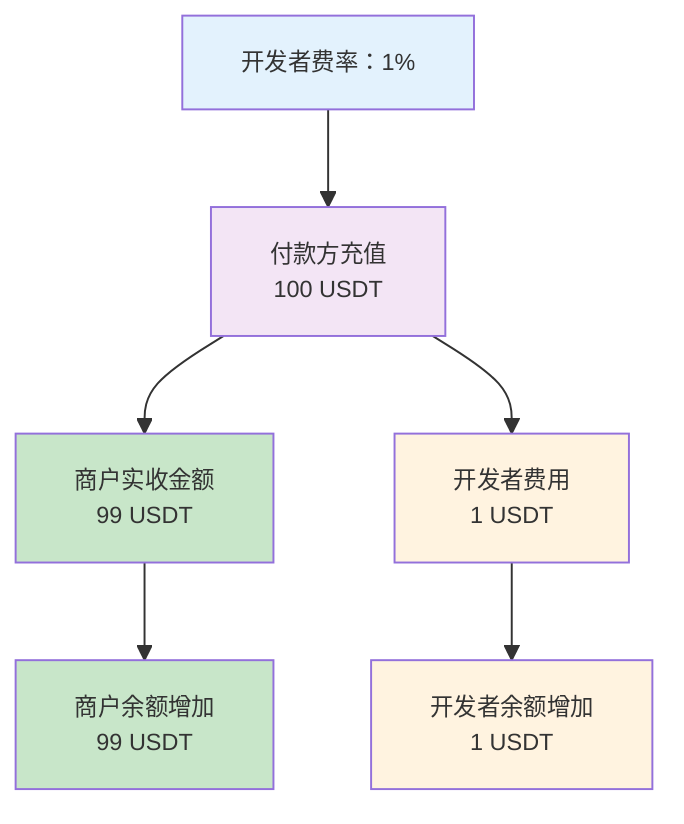
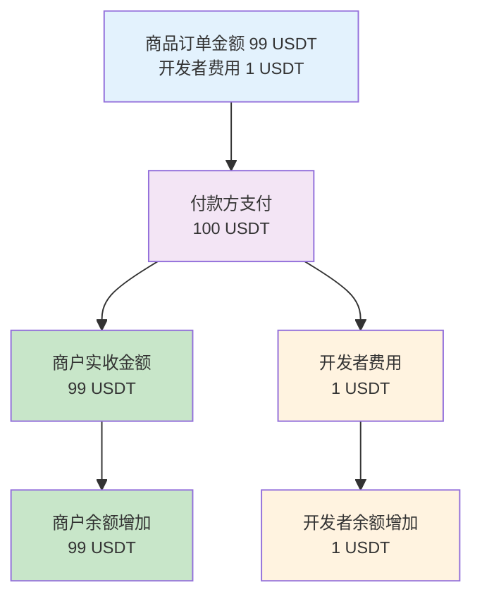
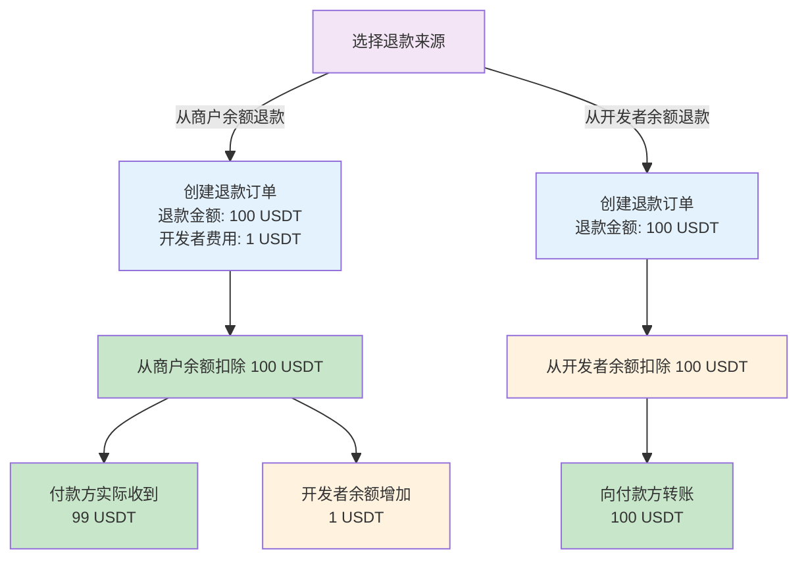
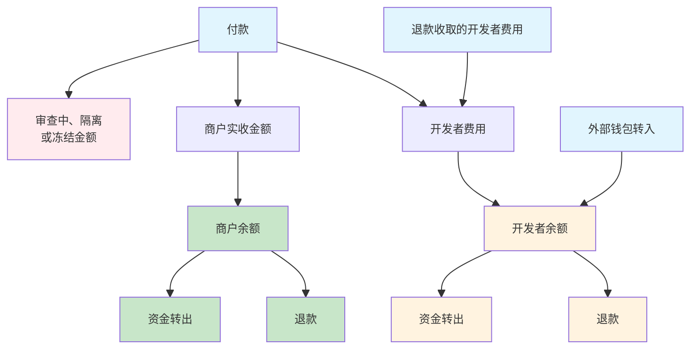

Cobo 为您维护两类资金的收支记录：**商户资金**与**开发者资金**。**商户**代表实际收款的业务主体，**开发者**则代表提供收款服务的主体（即您）。所有的收款都需要指定归属的商户，并通过开发者费用/费率确定开发者应获得的收入分成。

通过创建商户、设置开发者费用/费率，您可以实现自动化的资金结算和收入分成：

- 如果您直接服务于付款方：
  - 通常情况下仅需要创建一个商户（使用系统默认创建的商户即可），且无需配置开发者费率。
  - 如果您想要为不同的业务线单独管理资金，则可以为每个业务线创建一个商户。
- 如果您是服务于多个下游商户的平台型机构，则可以为每个下游商户在系统中创建一个商户，并通过设置开发者费用/费率来实现自动化的商家结算与平台收入分配。

更多关于商户管理的使用场景和说明，可以参考[商户管理](/payments/cn/guides/merchants)。

## 资金分配概览

下图展示了支付过程中资金的整体分配和流向（示例数据）：

## 资金分配规则

在不同的收款模式下，以及退款场景中，开发者费用的收取方式和计算规则各有不同。以下将详细介绍各种场景下的资金分配机制。

### 充值模式

在充值模式下，资金分配基于创建商户时设置的开发者费率（`developer_fee_rate`）。开发者费率决定每笔充值中开发者获得的比例。

**示例**：当开发者费率为 1% 时，100 USDT 充值将分配为商户资金 99 USDT 和开发者费用 1 USDT。

### 订单模式

在订单模式下，资金分配基于创建订单时设置的金额参数。开发者费用（`fee_amount`）与商品订单金额（`order_amount`）之间的比例决定每笔订单中开发者获得的比例。

**示例**：当商品订单金额为 99 USDT，开发者费用为 1 USDT 时，100 USDT 的订单实收金额将分配为商户实收金额 99 USDT 和开发者费用 1 USDT：

<Note>
特殊情况处理：

- 多付/少付：按上述相同比例分配资金
- 晚付：资金全部记为开发者费用
</Note>

### 退款

退款金额的来源可以是商户余额或开发者余额。

 - 当退款金额来源为商户余额时，您可以指定开发者费用金额。例如，当退款金额（`payable_amount`）为 100 USDT，开发者费用（`merchant_fee_amount`）为 1 USDT 时，100 USDT 的退款金额将分配 1 USDT 作为开发者费用，付款方实际收到 99 USDT。
- 当退款金额来源为开发者余额时，开发者费用字段将被忽略，退款金额将全额从开发者余额中扣除并转给付款方。

下图展示了退款过程中资金的分配和流向（示例数据）：

## 余额

下图展示了商户余额和开发者余额的主要来源和去向：

<Info>审查中/隔离/冻结金额将不被计入商户实收金额或开发者余额。</Info>

### 商户余额

**商户余额**指某一商户在特定时刻可提取或退款的资金总额。计算公式：

`商户余额 = 商户实收总金额 - 已提取的商户资金 - 已用于退款的商户资金`

该余额可以通过 Payments App 的**余额**模块或调用 [List merchant balances](/payments/en/api-references/payment/list-merchant-balances) 进行查询。

### 开发者余额

**开发者余额**指开发者在特定时刻可提取或退款的资金总额。计算公式：

`开发者余额 = 开发者费用总额 - 已提取的开发者资金 - 已用于退款的开发者资金`

<Info>开发者费用总额中，除了各类收款模式中的开发者费用，还包括从外部钱包转入的资金。</Info>

该余额可以通过 Payments App 的**余额**模块或调用 [Get developer balance](/payments/en/api-references/payment/get-developer-balance) 进行查询。

<Tip>欢迎您[提交反馈](https://forms.zohopublic.com/cobo/form/DocumentFeedbackForm/formperma/QvLOhxJv1_JMsJ-1dleZ8Itb_7rzN-LtgvsDdxosoVI)来帮助改进我们的文档！</Tip>