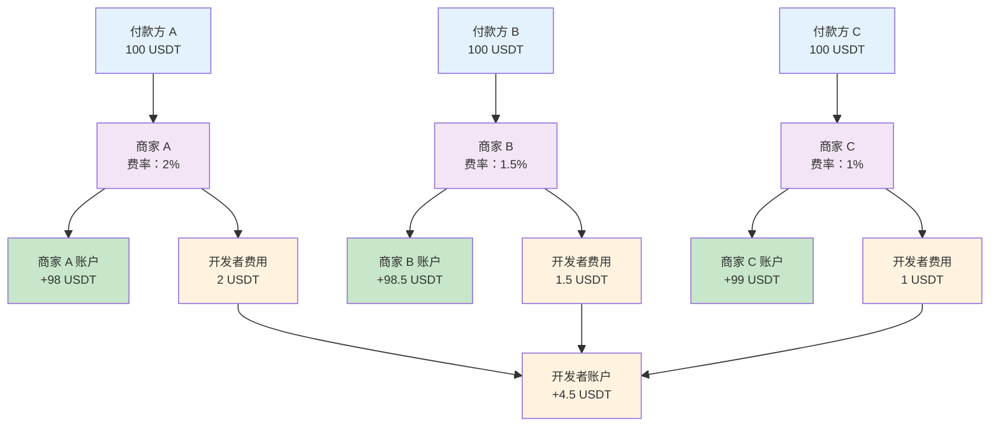

如果您是支付服务提供商（PSP）等平台机构，需要为多个下游商户提供服务，可以通过商户管理功能为每个商户独立进行收支管理，并通过设置开发者费率，实现与商户的自动化收入分成。

当付款方完成一笔支付后，系统会根据该笔支付关联的商户及其开发者费率/费用，自动将资金结算至对应的商户账户和开发者账户。下图展示了充值模式下，系统自动将资金结算至对应账户的流程：

## 商户创建与配置

<Note>系统会为每一个 Cobo Portal 团队自动创建一个与团队同名的**默认商户**。如果您直接服务付款方，没有下游商户，则可以直接使用默认商户，无需创建新商户。</Note>

您可以使用 Payments App 或 Payments API 创建商户。

<Tabs>
  <Tab title="Payments App" icon="pager">
  1. 登录 Cobo Portal [开发环境](https://portal.dev.cobo.com/login)。
  2. 在左侧导航栏中点击 **Apps**，然后点击 **Payments** 卡片，启动 App。
  3. 在 App 的左侧导航栏中点击**商户**。
  4. 点击**创建商户**按钮。
  5. 在弹窗中完成如下配置：
     - 填写商户名称。
     - 选择是否**启用独立钱包**。启用后，系统将为该商户新建专属钱包，所有收款地址仅用于接收该商户的收款，实现资金的彻底隔离。请注意，若开启独立钱包，部分资金转出（Payout）或划转操作可能会受到限制，建议根据实际业务需求权衡选择。
     - 设置**开发者费率**。开发者费率决定了您作为开发者从每笔收款中获得的分成比例。例如，设置为 1% 意味着每笔收款中的 1% 将作为开发者费用分配给您。您可以在创建商户后随时调整开发者费率。<Note>不同收款模式下收入分成规则不同。更多关于开发者费率和资金分配的详细说明，请参考[账户与资金分配](/payments/cn/guides/amounts-and-balances)。</Note>
     - 添加[转出目的地](/payments/cn/guides/destinations)，用于配置该商户专属的资金转出地址，包括钱包地址及银行账户。

如果您的后续操作涉及到 API 调用，则可以在创建完成后点击**查看详情**按钮获取并保存商户 ID。您需要在后续 API 调用中使用商户 ID 来标识该商户。

  </Tab>
  <Tab title="Payments API" icon="code">

1. 调用 [Create merchant](/payments/en/api-references/payment/create-merchant) 创建商户，在请求中传入以下信息：  
   * `name`: 商户名称
   * `wallet_setup`: （可选）钱包设置。每个钱包包含多个加密货币地址，作为商户的收款地址。根据您的业务需求，可以选择以下两种钱包设置：
       - **Shared**（默认）：多个商户共享同一个钱包。该钱包的地址可能同时用于接收多个商户的收款。
       - **Separate**：为商户创建专属钱包，实现资金完全隔离。该钱包的所有地址仅用于接收该商户的收款。
   * `developer_fee_rate`: （可选）开发者费率。开发者费率决定了您作为开发者从每笔收款中获得的分成比例。例如，设置为 1% 意味着每笔收款中的 1% 将作为开发者费用分配给您。您可以在创建商户后随时调整开发者费率。<Note>不同收款模式下收入分成规则不同。更多关于开发者费率和资金分配的详细说明，请参考[账户与资金分配](/payments/cn/guides/amounts-and-balances)。</Note>

   调用后，您将获取到商户 ID (`merchant_id`)，作为该商户在 Cobo 系统中的唯一标识符，用于后续 API 调用中标识该商户。

  </Tab>
</Tabs>

## 实际应用场景

每个商户代表一个独立的收款实体。商户可以是电商平台上的不同店铺，也可以是独立站的不同业务线，或者其他需要独立核算的业务单元。

### 电商平台服务多个商家

某电商平台为入驻商家分别创建独立商户，并根据不同商品类型设置差异化费率：

- **商家 A（电子产品）**：设置 2% 开发者费率
- **商家 B（服装）**：设置 1.5% 开发者费率  
- **商家 C（图书）**：设置 1% 开发者费率

平台可实时查看每个商家的交易数据和余额，实现差异化收费和精细化管理。

### 独立站多业务线管理

某独立站运营多个业务线，为每个业务线创建独立商户以实现资金隔离和独立核算：

- **主站销售**：服务于 B2C 业务线，处理主站个人消费者的付款
- **批发业务**：便于 B2B 客户管理和批发数据分析
- **海外业务**：满足跨境合规要求和汇率管理

这种架构实现了不同业务线的资金隔离、独立核算和精细化运营。

<Tip>欢迎您[提交反馈](https://forms.zohopublic.com/cobo/form/DocumentFeedbackForm/formperma/QvLOhxJv1_JMsJ-1dleZ8Itb_7rzN-LtgvsDdxosoVI)来帮助改进我们的文档！</Tip>