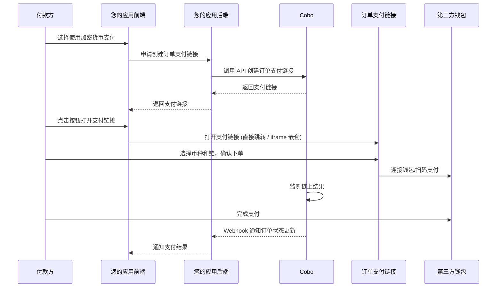

如果您选择通过订单模式进行收款，并希望节省自建支付页面的开发时间，可以调用 [Create order link](/payments/en/api-references/payment/create-order-link) 创建一个订单支付链接。

- 打开支付链接后，付款方将被引导至由 Cobo 托管的支付页面。付款方可以在该页面查看订单详情并完成支付，无需您自行开发前端交互流程。您还可以将支付页面通过 iFrame 方式嵌入到您的网站或应用中。
- 该支付链接兼容 PC 端和移动端，支持付款方唤起本地第三方钱包 App 或插件进行支付。详细的第三方钱包支持情况可参考[第三方钱包 App 支持范围](/payments/cn/guides/third-party-wallet-support)。
- 订单支付链接的标准格式为：`https://payment-link.dev.cobo.com/payment?token=<token>`，其中 `<token>` 是 Cobo 生成的唯一标识符，每个 token 与一笔支付订单唯一对应。

## 支付页面效果展示

### 移动端

下图展示了订单支付页面在移动端的交互流程（以连接第三方钱包为例）：

1. 付款方选择币种和链
2. 确认订单信息，并选择使用第三方钱包支付
3. 在第三方钱包列表选择钱包并完成支付。
4. 页面将自动跳转至支付成功页面。

### PC 端

下图展示了订单支付页面在 PC 端的交互流程（以连接第三方钱包为例）：

1. 付款方选择币种和链
2. 确认订单信息，并选择使用第三方钱包支付
3. 在第三方钱包列表选择钱包并完成支付。
4. 页面将自动跳转至支付成功页面。

## 示例项目

我们为集成订单支付链接提供了一个[完整示例项目](https://github.com/CoboGlobal/cobo-payment-link-demo)。该项目包含前端与后端的源码（均为 JavaScript 实现），可帮助您快速体验和参考集成流程。

- 前端主代码位于 `src/main.ts`，负责页面展示与支付流程触发。
- 后端代码集中在 `server.js`，负责与 Payments API 通信及订单支付链接的生成。

示例项目包含两种集成方式：点击 **Pay Now (By New Window)** 会在新标签页打开支付页面，点击 **Pay Now (By iframe)** 则会在当前页面以 iframe 形式嵌入支付窗口。

该示例项目前后端的交互流程如下：

1. 付款方点击 **Pay Now** 按钮后，前端会向后端发起请求，申请创建订单支付链接。
2. 后端收到请求后，通过调用 [Create order link](/payments/en/api-references/payment/create-order-link)，生成对应的订单支付链接。
3. 后端将该支付链接返回给前端。前端根据返回的链接，通过新窗口打开或在 iframe 中嵌入支付页面，付款方即可在该页面完成支付操作。

您可以在浏览器中打开开发者工具，查看网络请求的详细内容：

## 集成步骤

您可以调用 [Create order link](/payments/en/api-references/payment/create-order-link) 来创建一个订单支付链接。

### 交互流程

下图展示了付款方、您的应用前后端与 Cobo 之间的完整交互流程：

### 应付金额计算

创建订单支付链接时，您需要指定订单金额、开发者费用等关键参数。付款方进入支付页面后，可自行选择支付所用的币种和链。系统会结合您的设置与付款方的选择，自动计算出对应的应付金额，并在界面上实时展示。您也可以直接指定各种加密货币的应付金额。

- **订单金额**（`pricing_amount`）：订单金额，不包括开发者费用。
  - 如果设置了 `pricing_currency`，订单金额以该法币计价。
  - 如果未设置 `pricing_currency`，订单金额以 `payable_currency` 指定的加密货币计价。
- **开发者费用**（`fee_amount`）：如果您是服务多个下游商户的平台机构，需要在您和下游商户之间分配收入，可以通过设置该费用来实现。开发者费用和订单金额之间的比例决定了您和下游商户之间的收入分成比例。更多信息请参考[账户与资金分配](/payments/cn/guides/amounts-and-balances)。 

  <Info>如果您是商户（直接服务于付款方），通常无需设置开发者费用。</Info>
- **应付金额**（`payable_amounts`）：付款方实际需支付的加密货币金额，以 `payable_currency` 指定的加密货币为单位。该字段为可选字段：
  - 如果您指定了 `payable_amounts`，则系统直接使用这些值作为各种加密货币的应付金额。
  - 如果您未指定 `payable_amounts`，系统将使用实时汇率计算：**应付金额 =（订单金额 + 开发者费用）/ 汇率**。汇率以创建订单时调用 [Get exchange rate](/payments/en/api-references/payment/get-exchange-rate) 操作返回的汇率为准。

|                    | 场景 1                                         | 场景 2                                             | 场景 3                                                             | 场景 4                                           |
| :----------------- | :------------------------------------------- | :----------------------------------------------- | :--------------------------------------------------------------- | :--------------------------------------------- |
| 场景描述               | - 订单金额以法币计价 - 无需设置开发者费用 - 系统计算应付金额 | - 订单金额以 USDT 计价 - 无需设置开发者费用 - 系统计算应付金额 | - 订单金额以法币计价 - 设置开发者费用 - 自定义应付金额                        | - 订单金额以 USDC 计价 - 设置开发者费用 - 系统计算应付金额 |
| `pricing_amount`   | `"100"`                                      | `"100"`                                          | `"100"`                                                          | `"100"`                                        |
| `fee_amount`       | `"0"` 或不设置                                   | `"0"` 或不设置                                       | `"2"`                                                            | `"2"`                                          |
| `pricing_currency` | `"USD"`                                      | `"USDT"`                                         | `"USD"`                                                          | `"USDC"`                                       |
| 用户选择的币种            | `"ETH_USDT"`                                 | `"ETH_USDT"`                                     | `"ETH_USDT"`                                                     | `"ETH_USDT"`                                   |
| `payable_amounts`  | 不设置                                          | 不设置                                              | `[{"payable_currency": "ETH_USDT", "payable_amount": "104.08"}]` | 不设置                                            |
| 实时汇率               | 0.99                                         | 1                                                | 不适用（使用自定义应付金额）                                                   | 1                                              |
| 计算过程               | (100 + 0) / 0.99                             | (100 + 0) / 1                                    | 直接使用指定的 payable_amounts                                          | (100 + 2) / 1                                  |
| 最终应付金额             | `"101.01"`                                   | `"100"`                                          | `"104.08"`                                                       | `"102"`                                        |

