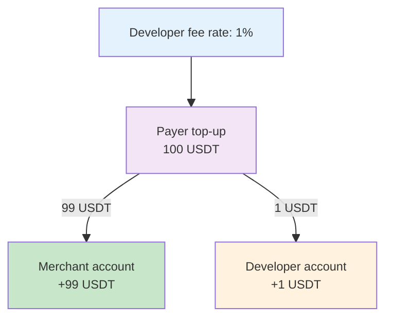
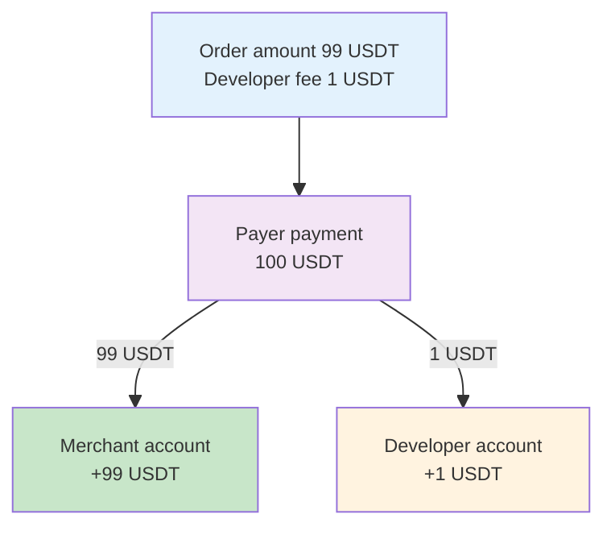
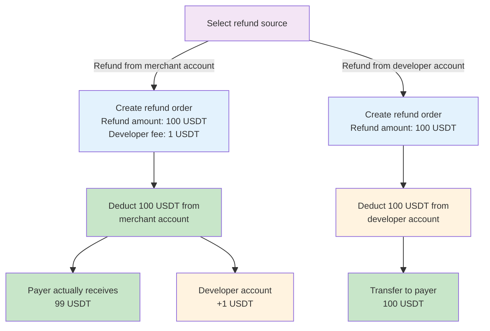
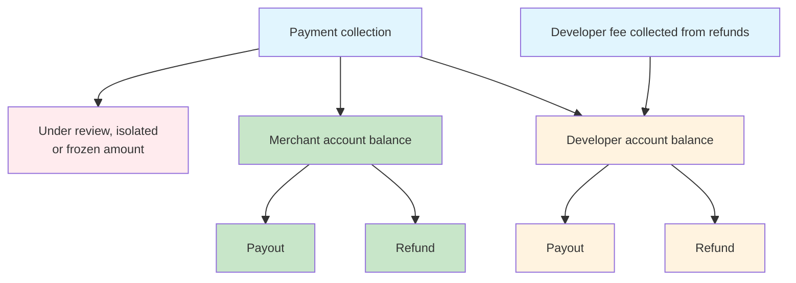

<Note>**Disclaimer: This article contains AI translations and should only be used as reference.** Contact Cobo's support team through [help@cobo.com](mailto:help@cobo.com) if you have any questions.</Note>

This article introduces the various types of accounts involved in fund management, and how funds are efficiently allocated and managed between accounts through **settlement** and **allocation** after payment collection.

## Accounts

An account is a virtual fund entity managed in the system ledger, without a one-to-one correspondence to on-chain wallets or addresses.
- Each operation such as payment collection, settlement, fees, refunds, or payouts creates detailed entries in the ledger, which dynamically update the balance of each account.
- Fund allocation between accounts (such as automatic settlement or manual allocation) only flows within the ledger and does not directly result in on-chain transfers. Only when performing payouts or refunds will actual on-chain asset transfers be triggered.

The following accounts are currently supported:

- **Developer account**: A single account that holds the developer balance. This represents funds belonging to you as the payment collection service provider.
- **Merchant accounts**: Each merchant corresponds to an account that holds its respective merchant balance. Each merchant represents an actual business entity receiving payments.

When you perform operations such as payouts or refunds, you need to select which account to use as the source of funds.

## Fund settlement and allocation

Funds can be distributed between accounts in two ways:

- **Automatic settlement**: During the payment collection process, funds are automatically settled to merchant accounts and the developer account based on predefined rules.
- **Manual allocation**: You can use the Allocate feature to manually transfer funds between accounts.

### Automatic settlement

When a payment is received, the system automatically distributes funds to the corresponding merchant account and developer account based on predefined rules. The diagram below illustrates this settlement process. The specific settlement rules may vary depending on the payment collection mode:

#### Top-up mode

In top-up mode, fund settlement is based on the developer fee rate (`developer_fee_rate`) set when creating the merchant. The developer fee rate determines the proportion of each top-up that is settled to the developer account.

**Example**: When the developer fee rate is 1%, a 100 USDT top-up will be settled as 99 USDT to the merchant account and 1 USDT to the developer account.

#### Order mode

In order mode, fund settlement is based on the amount parameters set when creating the order. The ratio between the developer fee (`fee_amount`) and the order amount (`pricing_amount`) determines the proportion of each order that is settled to the developer account.

**Example**: When the order amount is 99 USDT and the developer fee is 1 USDT, the actual received amount of 100 USDT will be settled as 99 USDT to the merchant account and 1 USDT to the developer account:

<Note>
Special case handling:

- Overpayment/Underpayment: Funds are settled according to the same ratio as above
- Late payment: All funds are settled to the developer account
</Note>

#### Refunds

The source of the refund amount can be either the merchant account or the developer account.

- When the refund amount comes from the merchant account, you can specify a developer fee to charge a service fee for the refund. For example, when the refund amount (`payable_amount`) is 100 USDT and the developer fee (`merchant_fee_amount`) is 1 USDT, 1 USDT from the 100 USDT refund will be settled to the developer account, and the payer will actually receive 99 USDT.
- When the refund amount comes from the developer account, the developer fee field will be ignored, and the full refund amount will be deducted from the developer account and transferred to the payer.

The following diagram shows the settlement and flow of funds during the refund process (sample data):

### Manual allocation

In addition to automatic settlement during payment collection, you can also use the Allocate feature to manually transfer funds between accounts. For details, see [Allocate funds](/payments/en/guides/allocate-funds).

## Balances

Account balance refers to the total amount of funds in an account that can be used for payouts or refunds at a specific moment. This balance can be queried through the **Balance** module in the Payments App or by calling [List merchant balances](/payments/en/api-references/payment/list-merchant-balances) and [Get developer balance](/payments/en/api-references/payment/get-developer-balance).

Balance changes mainly come from the following activities:

**Situations that increase balance:**
- Automatic settlement during payment collection
- Manual allocation transfer in
- Automatic settlement during refunds (only applicable to the developer account)

**Situations that decrease balance:**
- Payout
- Refund
- Manual allocation transfer out

The following diagram shows the main sources and destinations of merchant account balances and developer account balances (allocation operations not included):

