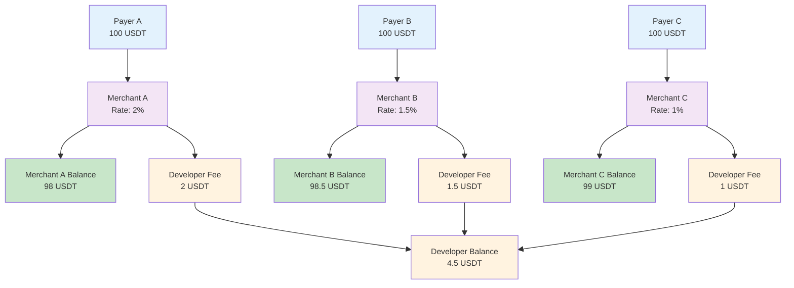
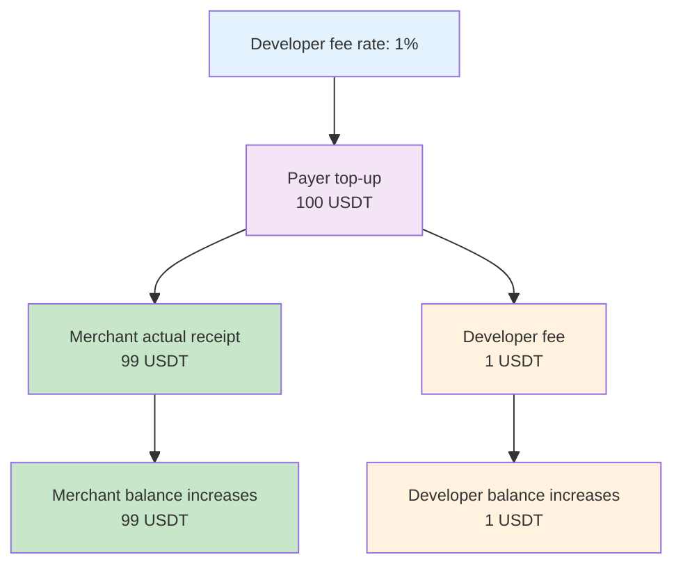
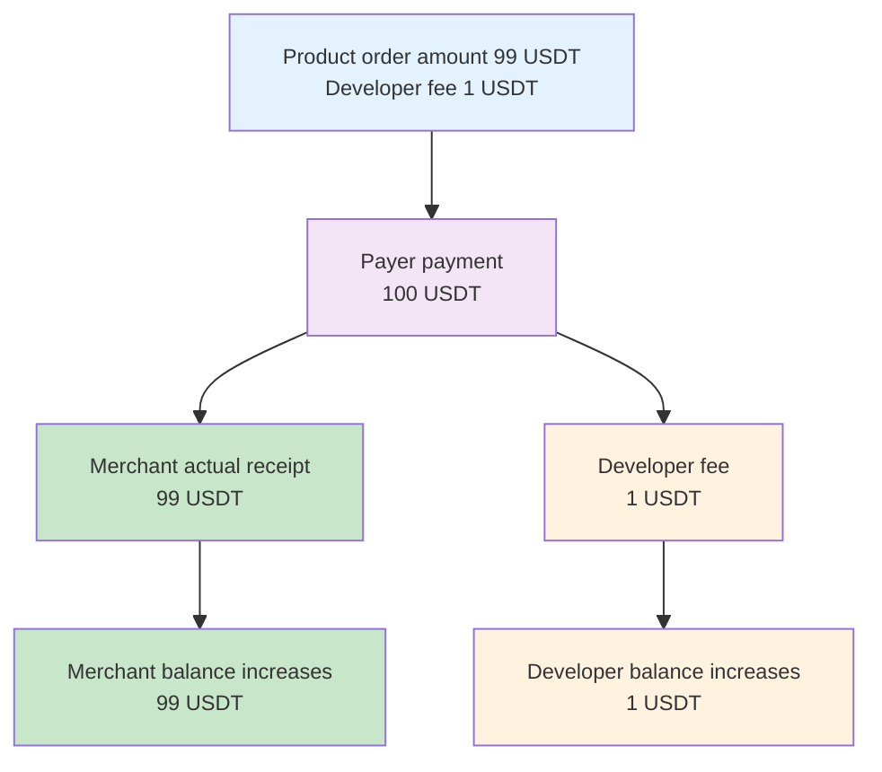
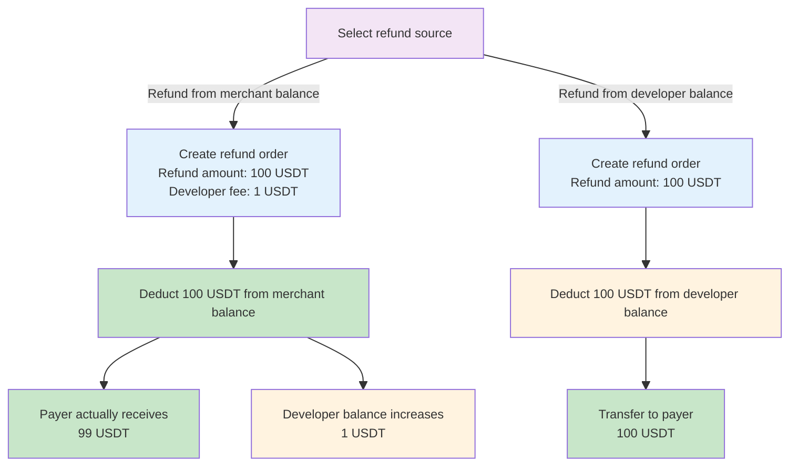
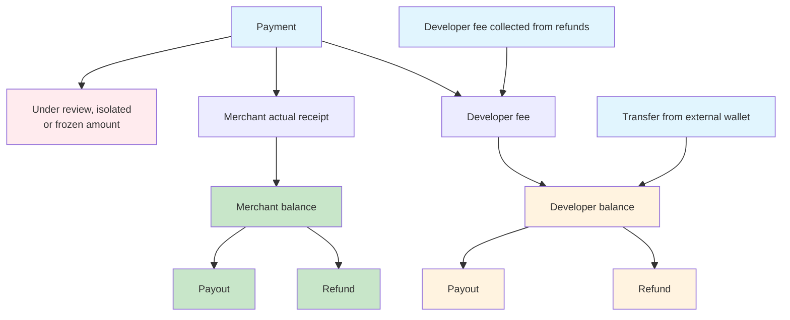

<Note>**Disclaimer: This article contains AI translations and should only be used as reference.** Contact Cobo's support team through [help@cobo.com](mailto:help@cobo.com) if you have any questions.</Note>

Cobo maintains revenue and expenditure records for two types of funds: **merchant funds** and **developer funds**. **Merchant** represents the actual business entity receiving payments, while **developer** represents the entity providing payment collection services (that is, you). All payment collection needs to specify the merchant to which it belongs, and determines the revenue share that the developer should receive through developer fees/rates.

By creating merchants and setting developer fees/rates, you can achieve automated fund settlement and revenue sharing:

- If you serve payers directly:
  - Usually, you only need to create one merchant (use the merchant created by default by the system), and no need to configure a developer fee rate.
  - If you want to manage funds separately for different business lines, you can create a merchant for each business line.
- If you are a platform institution serving multiple downstream merchants, you can create a merchant in the system for each downstream merchant and achieve automated merchant settlement and platform revenue allocation by setting developer fees/rates.

For more information on usage scenarios and descriptions of merchant management, refer to [Merchant management](/payments/en/guides/merchants).

## Amount allocation overview

The following diagram shows the overall allocation and flow of funds during the payment process (sample data):

## Amount allocation rules

In different pay-in types and refund scenarios, the collection method and calculation rules for developer fees differ. The following will detail the fund allocation mechanism in various scenarios.

### Top-up mode

In top-up mode, fund allocation is based on the developer fee rate (`developer_fee_rate`) set when creating the merchant. The developer fee rate determines the proportion the developer receives in each top-up.

**Example**: When the developer fee rate is 1%, a 100 USDT top-up will be allocated as 99 USDT merchant funds and 1 USDT developer fee.

### Order mode

In order mode, fund allocation is based on the amount parameters set when creating the order. The ratio between the developer fee (`fee_amount`) and the product order amount (`order_amount`) determines the proportion the developer receives in each order.

**Example**: When the product order amount is 99 USDT and the developer fee is 1 USDT, the actual received amount of 100 USDT from the order will be allocated as 99 USDT merchant actual receipt and 1 USDT developer fee:

<Note>
Special case handling:

- Overpayment/Underpayment: Allocate funds according to the same ratio as above
- Late payment: All funds are recorded as developer fee
</Note>

### Refunds

The source of the refund amount can be either the merchant balance or the developer balance.

 - When the refund amount comes from the merchant balance, you can specify the developer fee amount. For example, when the refund amount (`payable_amount`) is 100 USDT and the developer fee (`merchant_fee_amount`) is 1 USDT, 1 USDT from the 100 USDT refund amount will be allocated as the developer fee, and the payer will actually receive 99 USDT.
- When the refund amount comes from the developer balance, the developer fee field will be ignored, and the full refund amount will be deducted from the developer balance and transferred to the payer.

The following diagram shows the allocation and flow of funds during the refund process (sample data):

## Balance

The following diagram shows the main sources and uses of merchant balance and developer balance:

<Info>Under review/isolated/frozen amounts will not be counted towards merchant actual receipt or developer balance.</Info>

### Merchant balance

**Merchant balance** refers to the total amount of funds that a merchant can withdraw or refund at a specific moment. Calculation formula:

`Merchant balance = Total merchant actual receipt - Withdrawn merchant funds - Merchant funds used for refunds`

This balance can be queried through the **Balance** module of Payments App or by calling [List merchant balances](/payments/en/api-references/payment/list-merchant-balances).

### Developer balance

**Developer balance** refers to the total amount of funds that the developer can withdraw or refund at a specific moment. Calculation formula:

`Developer balance = Total developer fees - Withdrawn developer funds - Developer funds used for refunds`

<Info>In addition to developer fees in various pay-in types, the total developer fees also include funds transferred from external wallets.</Info>

This balance can be queried through the **Balance** module of Payments App or by calling [Get developer balance](/payments/en/api-references/payment/get-developer-balance).

<Tip>Feel free to [share your feedback](https://forms.zohopublic.com/cobo/form/DocumentFeedbackForm/formperma/QvLOhxJv1_JMsJ-1dleZ8Itb_7rzN-LtgvsDdxosoVI) to improve our documentation!</Tip>

