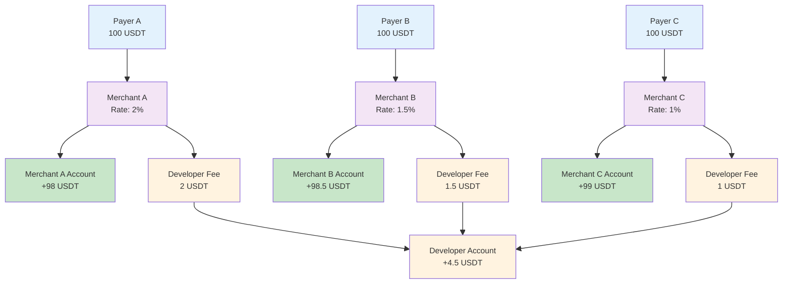

<Note>**Disclaimer: This article contains AI translations and should only be used as reference.** Contact Cobo's support team through [help@cobo.com](mailto:help@cobo.com) if you have any questions.</Note>

If you are a platform institution such as a payment service provider (PSP) that needs to provide services for multiple downstream merchants, you can use the merchant management function to independently manage revenue and expenses for each merchant, and achieve automated revenue sharing with merchants by setting developer fee rates.

When a payer completes a payment, the system automatically allocates funds to the corresponding merchant account and developer account based on the merchant associated with that payment and its developer fee rate/fee. The following diagram shows the process of automatic fund allocation to corresponding accounts in top-up mode:

## Merchant creation and configuration

<Note>The system automatically creates a **default merchant** with the same name as your Cobo Portal team. If you directly serve payers and have no downstream merchants, you can use the default merchant directly without creating new merchants.</Note>

You can create merchants using Payments App or Payments API.

<Tabs>
  <Tab title="Payments App" icon="pager">
  1. Log in to Cobo Portal [development environment](https://portal.dev.cobo.com/login).
  2. In the left navigation bar, click **Apps**, then click the **Payments** card to launch the App.
  3. In the App's left navigation bar, click **Merchants**.
  4. Click the **Create Merchant** button.
  5. Complete the following configuration in the pop-up window:
     - Enter the merchant name.
     - Choose whether to **Enable dedicated wallet**. When enabled, the system will create a dedicated wallet for the merchant, with all payment addresses used exclusively to receive payments for this merchant, achieving complete fund isolation. Please note that enabling dedicated wallets may restrict some payout or allocation operations, so it's recommended to balance this choice based on your actual business needs.
     - Set the **developer fee rate**. The developer fee rate determines the proportion of revenue you receive as a developer from each payment. For example, setting it to 1% means that 1% of each payment will be allocated to you as developer fees. You can adjust the developer fee rate at any time after creating the merchant. <Note>Different pay-in modes have different revenue sharing rules. For more details about developer fee rates and fund allocation, refer to [Accounts and fund allocation](/payments/en/guides/amounts-and-balances).</Note>
     - Add [Destinations](/payments/en/guides/destinations) to configure payout addresses dedicated to this merchant, including wallet addresses and bank accounts.

If your subsequent operations involve API calls, you can click the **View Details** button after creation to obtain and save the merchant ID. You will need to use the merchant ID to identify the merchant in subsequent API calls.

  </Tab>
  <Tab title="Payments API" icon="code">

1. Call [Create merchant](/payments/en/api-references/payment/create-merchant) to create a merchant, passing the following information in the request:  
   * `name`: Merchant name
   * `wallet_setup`: (Optional) Wallet setup. Each wallet contains multiple cryptocurrency addresses that serve as payment addresses for the merchant. Based on your business needs, you can choose from the following two wallet setups:
       - **Shared** (default): Multiple merchants share the same wallet. Addresses in this wallet may be used to receive payments for multiple merchants simultaneously.
       - **Separate**: Create a dedicated wallet for the merchant to achieve complete fund isolation. All addresses in this wallet are used exclusively to receive payments for this merchant.
   * `developer_fee_rate`: (Optional) Developer fee rate. The developer fee rate determines the proportion of revenue you receive as a developer from each payment. For example, setting it to 1% means that 1% of each payment will be allocated to you as developer fees. You can adjust the developer fee rate at any time after creating the merchant. <Note>Different pay-in modes have different revenue sharing rules. For more details about developer fee rates and fund allocation, refer to [Accounts and fund allocation](/payments/en/guides/amounts-and-balances).</Note>

   After calling, you will obtain the merchant ID (`merchant_id`), which serves as the unique identifier for this merchant in the Cobo system, used to identify the merchant in subsequent API calls.

  </Tab>
</Tabs>

## Practical application scenarios

Each merchant represents an independent payment collection entity. Merchants can be different stores on an e-commerce platform, different business lines of an independent online store, or other business units that require independent accounting.

### E-commerce platform serving multiple merchants

An e-commerce platform creates independent merchants for each settled merchant and sets differentiated rates based on different product types:

- **Merchant A (Electronics)**: Set a 2% developer fee rate
- **Merchant B (Clothing)**: Set a 1.5% developer fee rate  
- **Merchant C (Books)**: Set a 1% developer fee rate

The platform can view the transaction data and balance of each merchant in real time to achieve differentiated charging and refined management.

### Multiple business lines management for independent online stores

An independent online store operates multiple business lines and creates independent merchants for each business line to achieve fund isolation and independent accounting:

- **Main site sales**: Serves the B2C business line and processes payments from individual consumers on the main site
- **Wholesale business**: Facilitates B2B customer management and wholesale data analysis
- **Overseas business**: Meets cross-border compliance requirements and exchange rate management

This architecture achieves fund isolation, independent accounting, and refined operations for different business lines.

<Tip>Feel free to [share your feedback](https://forms.zohopublic.com/cobo/form/DocumentFeedbackForm/formperma/QvLOhxJv1_JMsJ-1dleZ8Itb_7rzN-LtgvsDdxosoVI) to improve our documentation!</Tip>

