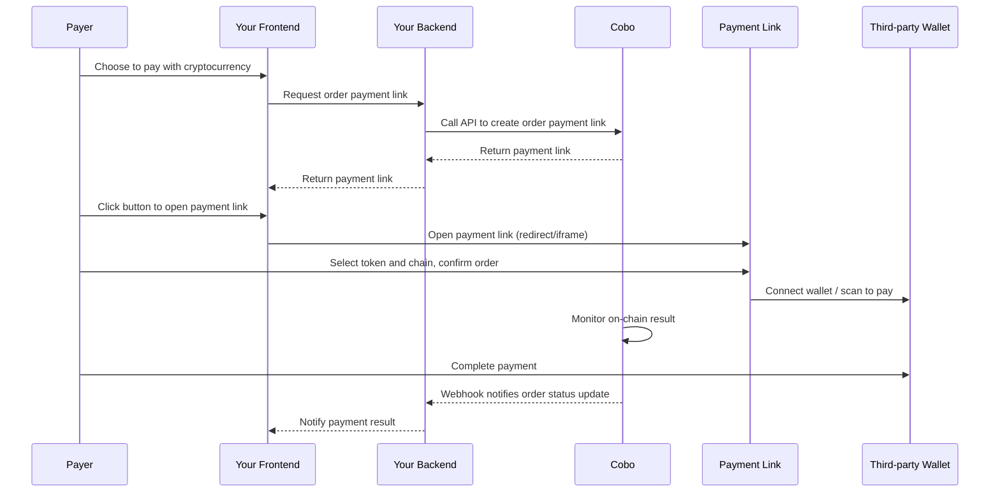

<Note>**Disclaimer: This article contains AI translations and should only be used as reference.** Contact Cobo's support team through [help@cobo.com](mailto:help@cobo.com) if you have any questions.</Note>

If you choose to collect payments via the order mode and want to save development time on your own payment page, you can call the [Create order link](/payments/en/api-references/payment/create-order-link) API to create an order payment link.

- When the payment link is opened, the payer will be directed to a payment page hosted by Cobo. On this page, the payer can view order details and complete the payment, so you don't need to develop the frontend interaction flow yourself. You can also embed the payment page into your website or application using an iFrame.

- The payment link is compatible with both desktop and mobile devices and allows payers to initiate payments with local third-party wallet apps or extensions. For details about supported third-party wallets, refer to [Third-party Wallet App Support](/payments/en/guides/third-party-wallet-support).

- The standard format of an order payment link is: `https://payment-link.dev.cobo.com/payment?token=<token>`, where `<token>` is a unique identifier generated by Cobo — each token corresponds to an order.

## Payment Page Showcase

### On Mobile

The diagram below shows the interaction process of the order payment page on mobile devices (taking third-party wallet connection as an example):
1. The payer selects a token and chain.
2. They confirm the order information and choose to pay with a third-party wallet.
3. They select the wallet from the list and complete the payment.
4. The page will automatically redirect to the payment success page.

### On Desktop

The diagram below shows the interaction process of the order payment page on desktop (again with third-party wallet connection as an example):
1. The payer selects a token and chain.
2. They confirm the order information and choose to pay with a third-party wallet.
3. They select the wallet from the list and complete the payment.
4. The page will automatically redirect to the payment success page.

## Example Project

We provide a [complete demo project](https://github.com/CoboGlobal/cobo-payment-link-demo) for integrating order payment links. The project contains both frontend and backend source code (implemented in JavaScript), which can help you quickly experience and reference the integration process.  
- The main frontend code is in `src/main.ts`, responsible for page display and triggering the payment process.  
- The backend code is in `server.js`, handling communication with the Payments API and generating order payment links.

The example project includes two integration methods: clicking **Pay Now (By New Window)** opens the payment page in a new tab, and clicking **Pay Now (By iframe)** embeds the payment page in the current page via iframe.

The interaction process between frontend and backend in this demo is as follows:

1. When the payer clicks the **Pay Now** button, the frontend sends a request to the backend to create an order payment link.
2. The backend receives the request and calls the [Create order link](/payments/en/api-references/payment/create-order-link) API to generate the payment link.
3. The backend returns the payment link to the frontend. The frontend then opens a new window or embeds the payment page in an iframe using the returned link, where the payer can complete the payment.

You can open your browser’s developer tools to see details of the network requests:

## Integration Steps

You can call the [Create order link](/payments/en/api-references/payment/create-order-link) API to create an order payment link.

### Interaction Flow
The diagram below shows the complete interaction flow between the payer, your application’s frontend and backend, and Cobo:

### Payable Amount Calculation

When creating an order payment link, you must specify the order amount, developer fee, and other essential parameters. Once the payer enters the payment page, they can choose the currency and blockchain for payment. The system will automatically calculate the payable amount based on your configuration and the payer’s selection, displaying it in real time on the UI. The calculation formula is as follows:

**Payable amount** = **(order amount + developer fee) / exchange rate**

- **Payable amount**: The actual cryptocurrency amount to be paid by the payer.
- **Order amount**: The `order_amount` field you provide when creating the order payment link.
- **Developer fee**: The `fee_amount` field you provide when creating the order. If you are a platform serving multiple downstream merchants and need to split revenue, you can set this field accordingly. The ratio of developer fee to order amount determines your revenue sharing ratio with your downstream merchants. For more information, see [Amounts and Balance Management](/payments/en/guides/amounts-and-balances).
  <Info>If you are a merchant (serving payers directly), you usually do not need to set a developer fee.</Info>
- **Exchange rate**:
    - If you specify the `custom_exchange_rates` field, the exchange rate will use the value from this field.
    - If you do not specify `custom_exchange_rates`, the system will use the real-time exchange rate between your specified `currency` (denominated for the order amount) and the actual cryptocurrency selected by the payer. The exchange rate at the time of checkout is returned by the [Get exchange rate](/payments/en/api-references/payment/get-exchange-rate) API.
  

The following table shows how the system calculates the payable amount in four different setups:

|  | Scenario 1 | Scenario 2 | Scenario 3 | Scenario 4 |
| :-- | :-- | :-- | :-- | :-- |
| Description | - Order amount in fiat currency  - No developer fee  - Use default exchange rate | - Order amount in USDT  - No developer fee  - Use default exchange rate  | - Order amount in fiat  - With developer fee  - Use custom exchange rate | - Order amount in USDT  - With developer fee  - Use default exchange rate |
| `order_amount` | `"100"` | `"100"` | `"100"` | `"100"` |
| `fee_amount` | `"0"` or unset | `"0"` or unset | `"2"` | `"2"` |
| `currency` | `"USD"` | `"USDT"` | `"USD"` | `"USDT"` |
| Payer's token choice | `"ETH_USDT"` | `"ETH_USDT"` | `"ETH_USDT"` | `"ETH_USDT"` |
| `custom_exchange_rates` | unset | unset |     `{"token_id": "ETH_USDT", "exchange_rate": "0.98"}` | unset |
| Real-time exchange rate | 0.99 | 1 | 0.99 | 1 |
| Calculation | (100 + 0) / 0.99 | (100 + 0) / 1 | (100 + 2) / 0.98 | (100 + 2) / 1 |
| `payable_amount` (Actual amount paid by payer) | `"101.01"` | `"100"` | `"104.08"` | `"102"` |

<Tip>Feel free to [share your feedback](https://forms.zohopublic.com/cobo/form/DocumentFeedbackForm/formperma/QvLOhxJv1_JMsJ-1dleZ8Itb_7rzN-LtgvsDdxosoVI) to improve our documentation!</Tip>

